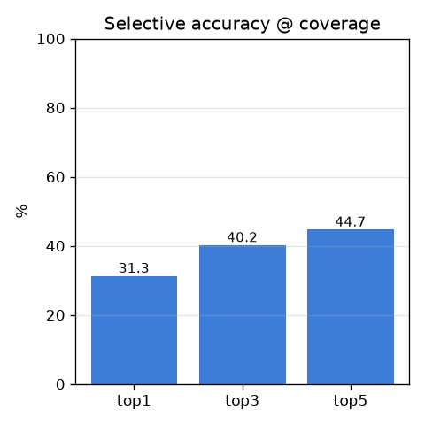
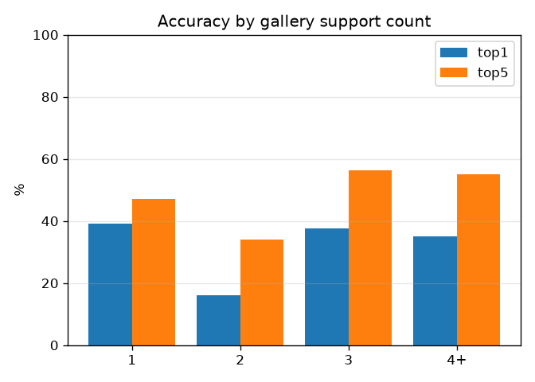
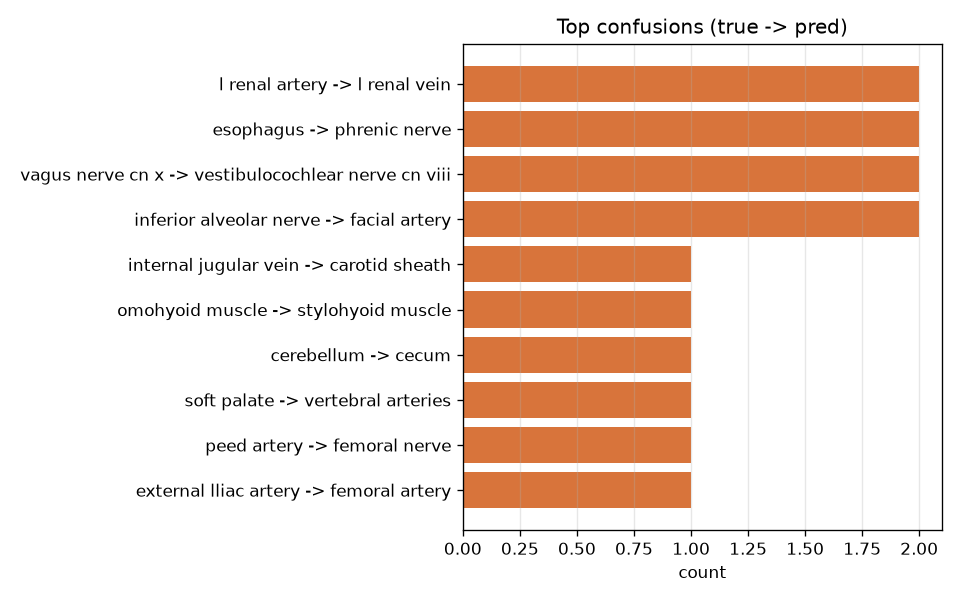

# 실험 001 — 베이스라인 (M4' 외형 MVP)

- 날짜: 2026-06-26
- 커밋: `data-pivot @ 7aec6b8`
- 스크립트: `scripts/eval_appearance.py`

## 목적
외형 신호만으로 **학습 없이**(frozen DINOv2 + GaussianPool + 프로토타입) 핀이 가리킨
구조물을 식별할 수 있는지 첫 검증. softmax 분류가 아니라 metric learning이라 long-tail
(클래스당 1~3샷)에 적합한지 본다.

## 방법
`I → frozen DINOv2(패치 격자) → 핀 q에서 GaussianPool → z_q(L2 정규화) →
클래스 프로토타입(갤러리 임베딩 평균)과 cosine 최근접 = 예측.`

## 설정
| 항목 | 값 |
|---|---|
| 백본 | dinov2_vitb14, 518px, frozen, mps |
| 풀링 | GaussianPool σ=40.0px |
| 거리 | cosine |
| 데이터 | `data/triples/triples.jsonl`, ≥2-인스턴스 코어 |
| 분할 | 표본(페이지) 단위, test_frac=0.3, seed=0 |
| 규모 | 코어 653 트리플 / 236 클래스 · 갤러리 460 / 테스트 193 · 프로토타입 229 |

## 결과
| 지표 | 값 |
|---|---|
| coverage | 92.7% (14개 OOV→기권) |
| **selective top1** | **31.3%** |
| selective top3 | 40.2% |
| selective top5 | 44.7% |
| end-to-end top1 (OOV=오답) | 29.0% |
| 무작위 기대 top1 | 0.44% |

### support(갤러리 샷 수)별 정확도
| 버킷 | n | top1 | top3 | top5 |
|---|---|---|---|---|
| 1-shot | 87 | 39.1% | 44.8% | 47.1% |
| 2-shot | 56 | 16.1% | 28.6% | 33.9% |
| 3-shot | 16 | 37.5% | 50.0% | 56.2% |
| 4+-shot | 20 | 35.0% | 45.0% | 55.0% |

### 주요 혼동 (정답 → 예측, 상위)
- `l renal artery -> l renal vein` ×2
- `esophagus -> phrenic nerve` ×2
- `vagus nerve cn x -> vestibulocochlear nerve cn viii` ×2
- `inferior alveolar nerve -> facial artery` ×2
- `internal jugular vein -> carotid sheath` ×1
- `omohyoid muscle -> stylohyoid muscle` ×1
- `cerebellum -> cecum` ×1
- `soft palate -> vertebral arteries` ×1

### 예측 예시 (O=정답, X=오답)

> ⚠️ 이 figure는 카데바 이미지를 포함하므로 git에 올리지 않습니다(로컬 전용, donor dignity §6).

## 해석
- top1 **31.3%** = 무작위(0.44%)의 **약 71배** → 외형 신호가 실재한다(가설 검증 성공).
- top5 44.7% → 5개 후보 안엔 절반 가까이 정답이 들어옴.
- coverage 92.7% → 테스트 대부분이 갤러리에 프로토타입을 가짐(나머지는 정직하게 기권).
- support별 정확도가 들쭉날쭉한 건 버킷별 n이 작고(수십 개), 서로 다른 표본의 뷰를 평균한
  프로토타입이 흐려질 수 있어서 — 데이터가 커지면 안정화될 노이즈로 본다.

## 한계
무파라미터 GaussianPool(σ=40.0px) · 관계추론 없음 · 보정/기권 미적용 · 모달리티(카데바/골표본/3D) 혼재 · 테스트 193개로 작음.

## 다음
σ 스윕 · bilinear 단일패치 vs 가우시안 · cosine vs L2 · 모달리티 분리(혼동 원인 규명) → 이후 M5' 보정+기권.
