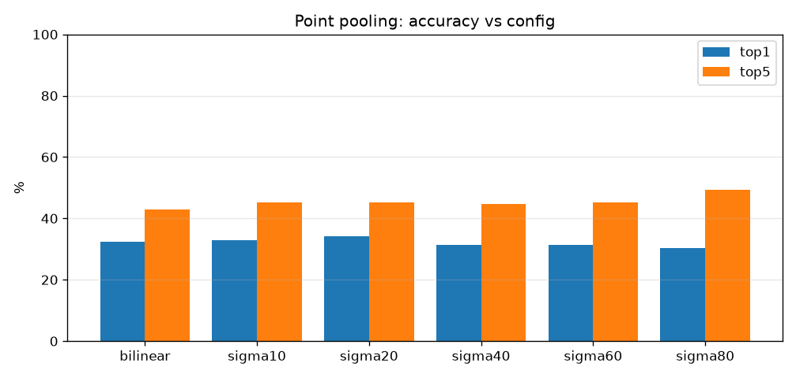

# 실험 002 — 점 풀링 애블레이션 (pooling)

- 날짜: 2026-06-26
- 커밋: `data-pivot @ ae3f9fc`
- 스크립트: `scripts/ablate_pooling.py`

## 목적
DINO 패치 격자를 핀 자리 임베딩 z_q로 만드는 **풀링 방식/폭**이 정확도에 주는 영향 측정.
베이스라인은 GaussianPool σ=40px. 더 좁게(구조물에 집중) vs 더 넓게(맥락 포함), 그리고
핀 한 점만 뽑는 bilinear를 비교한다. (학습 없음, DINO 격자는 한 번만 계산해 재풀링.)

## 설정
| 항목 | 값 |
|---|---|
| 백본 | dinov2_vitb14, 518px, frozen, mps |
| 데이터 | ≥2 코어 653 트리플 / 236 클래스 |
| 분할 | 표본 단위 test_frac=0.3 seed=0 (갤러리 460 / 테스트 193) |
| 거리 | cosine (정규화 임베딩이라 L2와 순위 동일 → 메트릭 애블레이션 생략) |
| 비교 | bilinear(단일점) · GaussianPool σ∈{10,20,40,60,80}px |

## 결과 (selective accuracy @ coverage)
| 풀링 | top1 | top3 | top5 |
|---|---|---|---|
| bilinear | 32.4% | 40.2% | 43.0% |
| sigma10 | 33.0% | 43.0% | 45.3% |
| sigma20 | 34.1% | 42.5% | 45.3% |
| sigma40 | 31.3% | 40.2% | 44.7% |
| sigma60 | 31.3% | 41.3% | 45.3% |
| sigma80 | 30.2% | 43.6% | 49.2% |

- **베스트: `sigma20` — top1 34.1%** (σ40 베이스라인 31.3% 대비 +2.8%p)

## 해석
- σ가 정확도에 주는 영향으로 "핀 주변 얼마나 좁게 봐야 하는가"를 알 수 있다.
  좁을수록(σ작음/bilinear) 핀 구조물에 집중, 넓을수록 맥락을 섞는다.
- 패치=14px이므로 σ≈14는 약 1패치, σ40은 약 3패치 범위.

## 다음
베스트 풀링을 기본값으로 → 모달리티 분리 분석, 이후 M5' 보정+기권.
