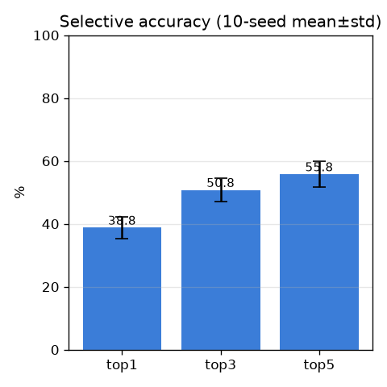
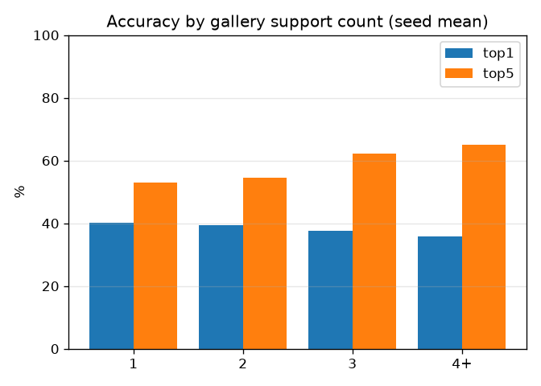
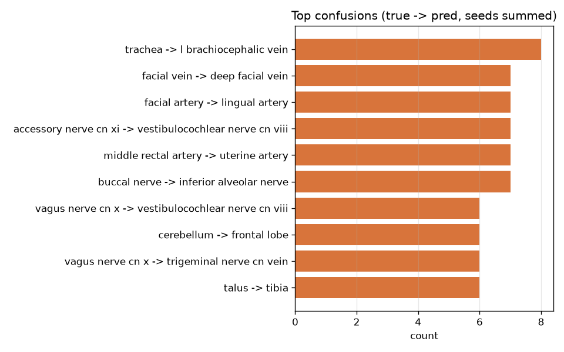

# 베이스라인 (baseline-mseed) — M4' 외형 MVP

- 날짜: 2026-06-26
- 커밋: `data-pivot @ 059f975`
- 스크립트: `scripts/eval_appearance.py`  (multi-seed 기본)

## 목적
외형 신호만으로 **학습 없이**(frozen DINOv2 + GaussianPool + 프로토타입) 핀이 가리킨
구조물을 식별할 수 있는지 검증. 테스트셋이 작아(~180) 단일 split은 ±3-4%p로 흔들리므로,
임베딩을 한 번만 하고 **10개 seed**로 분할만 바꿔 **mean±std**를 보고한다.

## 방법
`I → frozen DINOv2(패치 격자) → 핀 q에서 GaussianPool → z_q(L2 정규화) →
클래스 프로토타입(갤러리 평균)과 cosine 최근접 = 예측.` (metric learning, long-tail용)

## 설정
| 항목 | 값 |
|---|---|
| 백본 | dinov2_vitb14, 518px, frozen, mps |
| 풀링 | GaussianPool σ=40.0px |
| 데이터 | `data/triples/triples.jsonl`, ≥2 코어: 601 트리플 / 215 클래스 |
| 분할 | 표본(페이지) 단위, test_frac=0.3, seeds=0..9 |
| 프로토타입 | 평균 200개 |

## 결과 (10-seed, mean±std)
| 지표 | 값 |
|---|---|
| coverage | 83.2% |
| **selective top1** | **38.8 ± 3.4%** |
| selective top3 | 50.8 ± 3.7% |
| selective top5 | 55.8 ± 4.0% |
| 무작위 기대 top1 | 0.5% |

per-seed top1: [36.2, 42.0, 43.0, 34.1, 38.4, 43.0, 36.2, 37.1, 34.8, 42.7]

### support(갤러리 샷 수)별 정확도 (seed 평균)
| 버킷 | n(평균) | top1 | top5 |
|---|---|---|---|
| 1-shot | 72 | 40.2% | 52.9% |
| 2-shot | 37 | 39.4% | 54.5% |
| 3-shot | 24 | 37.5% | 62.3% |
| 4+-shot | 18 | 35.7% | 65.1% |

### 주요 혼동 (정답 → 예측, seed 합산 상위)
- `trachea -> l brachiocephalic vein` x8
- `facial vein -> deep facial vein` x7
- `facial artery -> lingual artery` x7
- `accessory nerve cn xi -> vestibulocochlear nerve cn viii` x7
- `middle rectal artery -> uterine artery` x7
- `buccal nerve -> inferior alveolar nerve` x7
- `vagus nerve cn x -> vestibulocochlear nerve cn viii` x6
- `cerebellum -> frontal lobe` x6

### 예측 예시 (seed 0, O=정답 X=오답)

> ⚠️ 카데바 이미지 포함 → git 제외(로컬 전용, §6).

## 해석
- top1 **38.8±3.4%** = 무작위(0.5%)의 약 **78배** → 외형 신호 실재.
- ±3.4%p가 분할 노이즈 폭. 단일 seed 비교로 작은 차이를 논하면 안 됨.
- 혼동은 대부분 해부학적 인접/유사 구조물 → 관계추론(M6')이 메울 지점.

## 한계
무파라미터 GaussianPool · 관계추론 없음 · 보정/기권 미적용 · 모달리티 혼재 · 코어 601 트리플.

## 다음
풀링(σ) · 모달리티 분리 · M5' 보정+기권. 비교는 항상 multi-seed mean±std로.
