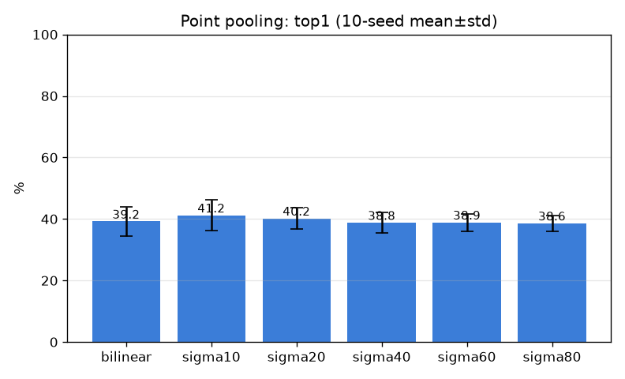

# 점 풀링 애블레이션 (pooling) — multi-seed

- 날짜: 2026-06-26
- 커밋: `data-pivot @ ef20496`
- 스크립트: `scripts/ablate_pooling.py`

## 목적
DINO 패치 격자를 핀 임베딩 z_q로 만드는 **풀링 방식/폭**의 영향 측정. 더 좁게(구조물 집중)
vs 넓게(맥락), bilinear 단일점 비교. DINO 격자는 1회 캐시 후 재풀링, **10-seed mean±std**.

## 설정
| 항목 | 값 |
|---|---|
| 백본 | dinov2_vitb14, 518px, frozen, mps |
| 데이터 | ≥2 코어 601 트리플 / 215 클래스 |
| 분할 | 표본 단위 test_frac=0.3, seeds=0..9 |
| 비교 | bilinear · GaussianPool σ∈{10,20,40,60,80}px |

## 결과 (selective accuracy, mean±std)
| 풀링 | top1 | top5 |
|---|---|---|
| bilinear | 39.2±4.8% | 51.3±3.5% |
| sigma10 | 41.2±5.0% | 54.4±4.4% |
| sigma20 | 40.2±3.5% | 55.5±3.5% |
| sigma40 | 38.8±3.4% | 55.8±4.0% |
| sigma60 | 38.9±2.8% | 57.3±4.1% |
| sigma80 | 38.6±2.6% | 59.3±3.3% |

- **베스트 top1: `sigma10` = 41.2±5.0%** (σ40 기준 38.8%; 차이가 std 안이면 무의미).

## 해석
- σ가 좁을수록 핀 구조물 집중, 넓을수록 맥락 포함. std를 넘는 차이만 유의미.

## 다음
유의미하게 나은 풀링이 있으면 기본값 채택 → 모달리티 분석 / M5'.
