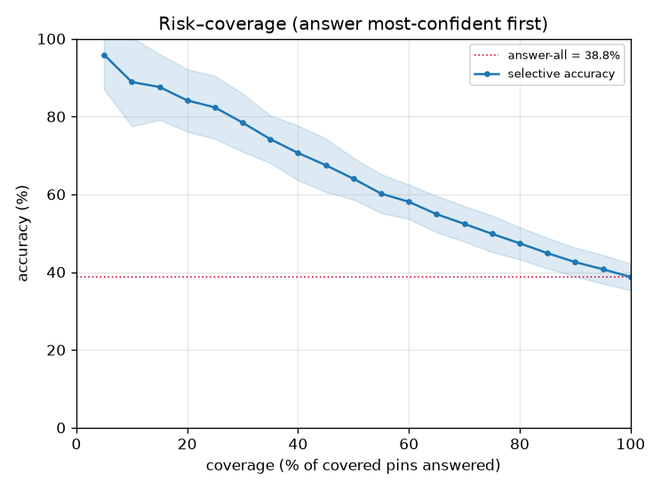
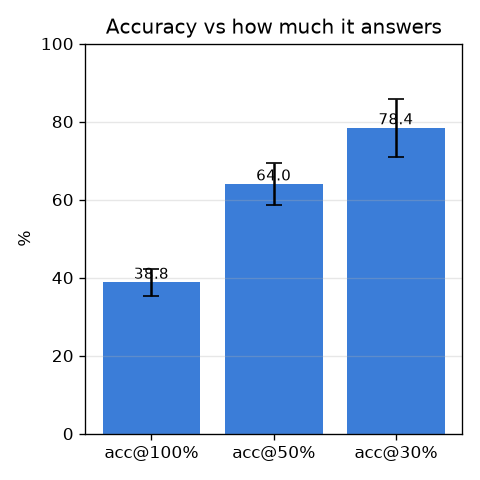

# M5' — 보정 + 기권 (calibration / abstention)

- 날짜: 2026-06-26
- 커밋: `data-pivot @ 40ab702`
- 스크립트: `scripts/eval_calibration.py`  (10-seed mean±std)

## 목적
"전부 38.8%로 답하기"보다 **확신하는 것만 답하고 나머진 기권**하는 게 땡시 보조로 유용하다.
외형 전문가의 cosine 유사도를 `softmax(s·sims)` 확률로 바꾸고(s는 갤러리 LOO로 NLL 최소화 →
보정), 확신도 순으로 답하며 coverage–정확도 trade-off(risk–coverage)를 측정한다.

## 결과 (10-seed, 코어 601/215 클래스)
| 운영점 | 정확도 |
|---|---|
| 전부 답 (coverage 100%) | 38.8 ± 3.4% |
| 확신 상위 50%만 답 | **64.0 ± 5.3%** |
| 확신 상위 30%만 답 | **78.4 ± 7.5%** |
| 정확도 70% 유지하며 답할 수 있는 비율 | 38.0% |
| 정확도 80% 유지하며 답할 수 있는 비율 | 24.0% |

보정 전/후 ECE: **0.4 → 0.2** (낮을수록 확신도가 실제 정확도에 가까움), 보정 scale s≈13.

## 해석
- 확신 구간만 고르면 정확도가 38.8% → 상위30% 기준 **78.4%**로 올라간다 → "**모르면 기권**"이
  실제로 작동. 땡시 보조로는 전체를 낮게 답하는 것보다 이게 가치.
- 보정으로 ECE가 0.4→0.2로 줄어 확신도 임계값(τ)을 실제 정확도로 해석 가능.
- 단, 여기 coverage는 *프로토타입이 있는* 핀 기준. 새 시신의 미지 구조물(OOV)은 별도로 항상 기권.

## 한계 / 다음
정확도 자체의 상한은 외형 전문가(top1 ~38.8%)가 결정 → 더 올리려면 **M6' 관계추론**(인접
구조물 혼동 분리) 또는 데이터 확장. M5'는 그 위에 "신뢰" 레이어를 얹어 지금 모델을 쓸 수 있게 만든다.
