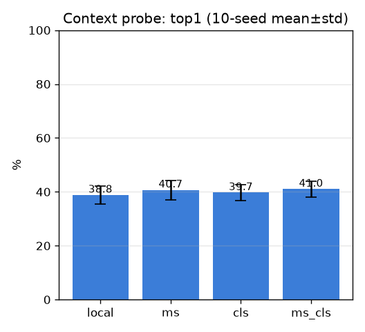

# 관계/맥락 프로브 (context-probe) — multi-seed

- 날짜: 2026-06-26
- 커밋: `data-pivot @ 816de3a`
- 스크립트: `scripts/probe_context.py`

## 목적
"이웃/맥락 정보가 외형 천장(top1 38.8%)을 올리는가?"를 **학습 없이, 분할 없이** 싸게 검증.
무거운 M6'(scene graph + R-GCN) 투자 전 de-risk. 핀 임베딩에 다중 스케일 풀링 + 전역 CLS를
붙여 본다. (cosine = 부분별 cosine 평균이 되도록 부분 정규화 후 concat.)

## 설정
| 항목 | 값 |
|---|---|
| 백본 | dinov2_vitb14, 518px, frozen, mps |
| 데이터 | ≥2 코어 601 트리플 / 215 클래스 |
| 분할 | 표본 단위 test_frac=0.3, 10 seeds |
| 변형 | local(σ40) · ms(σ20+σ80) · cls(σ40+CLS) · ms_cls |

## 결과 (selective accuracy, mean±std)
| 변형 | top1 | top5 |
|---|---|---|
| local | 38.8±3.4% | 55.8±4.0% |
| ms | 40.7±3.6% | 57.3±3.4% |
| cls | 39.7±2.9% | 64.0±3.5% |
| ms_cls | 41.0±2.9% | 61.9±3.5% |

## 판정
- 베스트: **ms_cls** top1 41.0±2.9% (local 38.8±3.4, Δ+2.2%p)
- 베이스라인 노이즈 폭 ±3.4%p 기준 → **노이즈 안 — 단순 맥락 concat은 무효**

## 해석 / 다음
- 맥락이 노이즈 밖으로 도움되면 → **풀 M6'(관계추론)** 투자 정당화.
- 도움 안되면 → 단순 맥락 concat으론 부족(천장이 외형 자체 또는 *구조화된* 관계 필요) → 데이터 확장
  또는 학습형 관계 모델로 선회.
