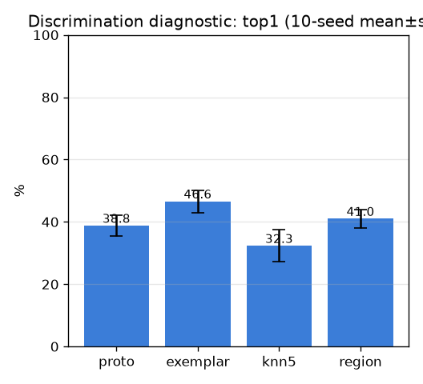

# 판별 진단 (discrimination-probe) — multi-seed

- 날짜: 2026-06-26
- 커밋: `data-pivot @ f3f5ded`
- 스크립트: `scripts/probe_discrimination.py`

## 목적
top1 천장(~38.8%)이 *특징 한계*인지, *재순위/판별 규칙*으로 풀리는지 **학습 없이** 진단.
같은 frozen 임베딩에 retrieval 규칙만 바꿔본다: 평균 프로토타입 vs 최근접 exemplar vs k-NN
투표 vs region(CLS)-gated. 어느 하나라도 노이즈 밖으로 top1을 올리면 학습형 판별 헤드가 유망.

## 설정
| 항목 | 값 |
|---|---|
| 백본/풀링 | dinov2_vitb14 518px frozen · GaussianPool σ40 |
| 데이터 | ≥2 코어 601 트리플 / 215 클래스, 표본분할 10 seed |
| region λ | [0.1, 0.2, 0.3, 0.5, 0.7, 1.0] 중 seed별 최적 (평균 λ≈0.4) |

## 결과 (selective accuracy, mean±std)
| 방법 | top1 | top5 |
|---|---|---|
| proto | 38.8±3.4% | 55.8±4.0% |
| exemplar | 46.6±3.6% | 57.9±4.4% |
| knn5 | 32.3±5.1% | 57.9±4.4% |
| region | 41.0±3.0% | 55.8±4.0% |

## 판정
- 베스트: **exemplar** top1 46.6±3.6% (proto 38.8±3.4, Δ+7.8%p)
- → **학습/구조 보상 신호 있음**

## 해석 / 다음
- training-free 재순위가 천장을 못 깨면 → **학습형 판별 헤드(metric learning / PinCrossAttention)**
  로 look-alike를 임베딩 공간에서 분리하는 게 다음 (frozen 백본 + 작은 헤드 + episodic + 증강 +
  cross-cadaver multi-seed 정직 평가).
- region이 도움되면 → 그 신호를 학습 목표/입력에 포함.
