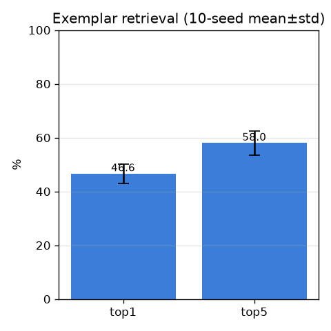
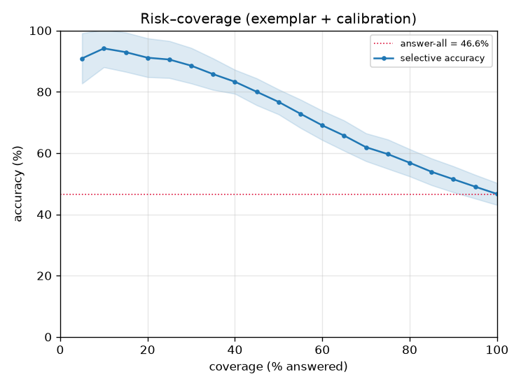

# 정식 모델: exemplar retrieval + 보정 (baseline-exemplar)

- 날짜: 2026-06-26
- 커밋: `data-pivot @ 93e2c09`
- 스크립트: `scripts/eval_exemplar.py`  (10-seed mean±std)

## 무엇이 바뀌었나
exp 009에서 **최근접 단일 exemplar(1-NN) > 평균 프로토타입 +8%p**를 확인 → retrieval 규칙을
exemplar로 교체. 클래스 점수 = max cosine(z_q, 갤러리 exemplar), 나머지(보정/기권)는 동일.

## 결과 (601 트리플 / 215 클래스)
| 지표 | proto(005/007) | **exemplar(현재)** |
|---|---|---|
| top1 | 38.8±3.4% | **46.6±3.6%** |
| top5 | 55.8±4.0% | **58.0±4.4%** |
| coverage | 83% | 83.2% |
| 확신 상위 30%만 답 | 78.4% | **88.5±5.8%** |
| 확신 상위 50%만 답 | 64.0% | 76.7±4.1% |
| 정확도 80% 유지 coverage | 24% | 42.0% |
| ECE (보정 후) | 0.2 | 0.2 |

## 해석
- 학습 0으로 top1 46.6%, top5 58.0% — 평균 프로토타입의 디테일 손실을 제거한 결과.
- 기권을 붙이면 확신 상위 30%에서 **88.5%** → 신뢰 구간 정확도가 더 올라감.
- 여전히 무학습. 다음 레버는 **학습형 판별 헤드**(look-alike 분리)와 **데이터(coverage)**.

## 다음
exemplar를 기본 retrieval로 채택(코드 반영). 이후 학습형 metric 헤드 실험 → top1 추가 상승 시도.
