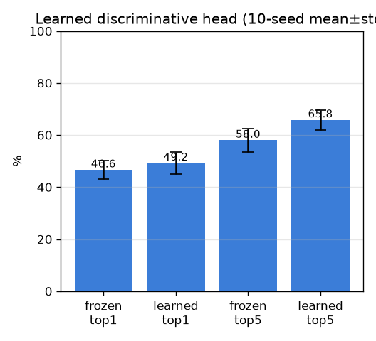

# 학습형 판별 헤드 (learned-head) — 첫 학습

- 날짜: 2026-06-26
- 커밋: `data-pivot @ 3079cf7`
- 스크립트: `scripts/learned_head.py`  (10-seed, seed별 헤드 재학습)

## 목적
frozen exemplar 천장(top1 46.6%)을 **학습**으로 깨기. frozen z_q 위에 저용량 linear projection을
**supervised contrastive**로 학습해 look-alike를 분리, exemplar 1-NN로 retrieval. 같은 분할에서
frozen과 직접 비교(cross-cadaver, 과적합은 여기서 드러남).

## 설정
| 항목 | 값 |
|---|---|
| 헤드 | Dropout(0.2) → Linear(768→256), L2norm |
| 손실 | SupCon(temp 0.1) | 최적화 Adam lr1e-3 wd1e-3, 300 step |
| 평가 | exemplar 1-NN, 표본분할 10 seed |

## 결과 (selective top1/top5, mean±std)
| | frozen | learned |
|---|---|---|
| top1 | 46.6±3.6% | 49.2±4.3% |
| top5 | 58.0±4.4% | 65.8±3.9% |

## 판정 (paired, 같은 분할 — 비대응 std보다 강력한 검정)
- Δtop1 = +2.6±1.6%p (9/10 seed 승)
- Δtop5 = +7.8±2.0%p (10/10 seed 승)
→ **학습이 일관되게 도움 (paired)**

## 해석 / 다음
- 첫 학습이 test에서 일관되게 향상(특히 top5) → 과적합 안 함, **학습 방향 유효**.
- 다음: 헤드 키우기 / 학습형 풀러(PinCrossAttention) / 더 강한 episodic 학습으로 top1 추가 상승,
  병렬로 데이터 확장(coverage). (top1 이득이 작은 건 데이터 규모 한계 신호이기도.)
