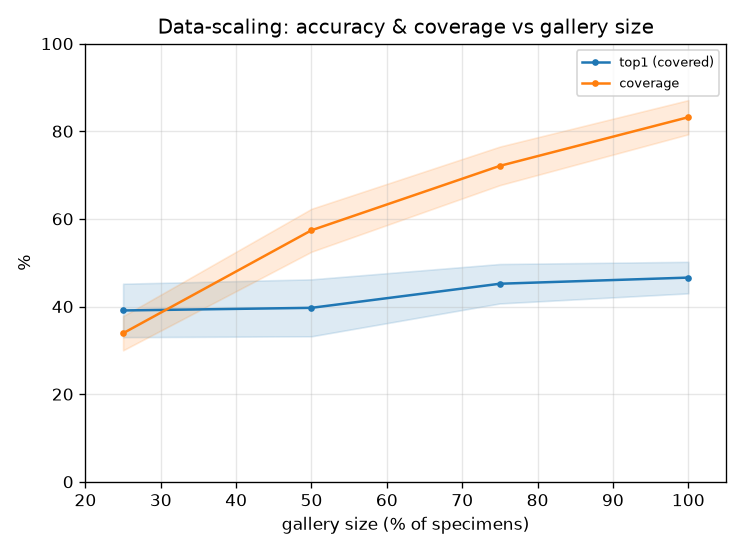

# 데이터 스케일링 곡선 (learning-curve)

- 날짜: 2026-06-26
- 커밋: `data-pivot @ 935d234`
- 스크립트: `scripts/learning_curve.py`  (frozen exemplar, 10-seed)

## 목적
top1의 병목이 **데이터 규모**인지 직접 판정. 갤러리를 표본 단위로 25→100%로 줄여가며 top1(covered)
과 coverage를 측정. 100%에서도 상승 중이면 더 모을수록 오른다 = 데이터가 레버.

## 결과
| 갤러리 | ~트리플 | top1(covered) | coverage |
|---|---|---|---|
| 25% | ~108 | 39.1±6.1% | 33.9±3.9% |
| 50% | ~213 | 39.7±6.5% | 57.4±4.9% |
| 75% | ~317 | 45.2±4.5% | 72.1±4.4% |
| 100% | ~420 | 46.6±3.6% | 83.2±3.9% |

## 판정
- 마지막 25%(75→100%) 구간 Δtop1 = +1.4%p → **데이터가 레버 — 100%에서도 top1 상승 중 (더 모으면 오름)**
- coverage는 갤러리와 함께 단조 증가 → 새 구조물 커버는 *명백히* 데이터에 비례.

## 해석 / 다음
- top1 곡선이 100%에서도 오르면 → **데이터 확장이 최우선 레버**(coverage + 정확도 동시 개선).
  모델 레버(학습형 풀러/M6')는 그 위에서 추가 이득.
- 평탄하면 → 데이터만으론 부족, **구조적 관계(M6')** 가 천장 돌파의 핵심.
