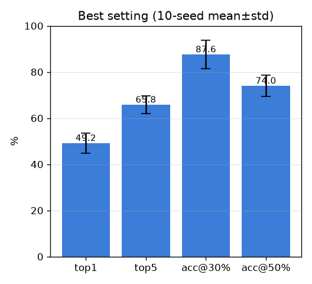
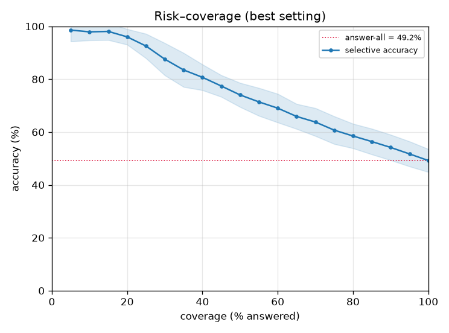

# 최고 세팅 최종 성능 (best-setting)

- 날짜: 2026-06-27
- 커밋: `data-pivot @ b82e25d`
- 스크립트: `scripts/best_setting.py`  (10-seed mean±std)

## 세팅 (전체 스택)
frozen DINOv2(vitb14, 518px) → 핀 GaussianPool(σ40) → **학습 SupCon 헤드** →
**exemplar 1-NN**(학습 공간) → **temperature 보정**(갤러리 LOO) → **risk-coverage 기권**.

## 결과 (601 트리플 / 215 클래스, 표본분할 10 seed)
| 지표 | frozen-exemplar(010) | **best(현재)** |
|---|---|---|
| top1 (전부 답) | 46.6% | **49.2 ± 4.3%** |
| top5 | 58.0% | **65.8 ± 3.9%** |
| coverage | 83% | 83.2% |
| **확신 상위 30%만 답** | 88.5% | **87.6 ± 6.1%** |
| 확신 상위 50%만 답 | 64.0% | 74.0 ± 4.6% |
| 정확도 80% 유지 coverage | 24% | 39.0% |
| ECE (보정 후) | 0.2 | 0.3 |

## 한 줄
전부 답하면 **top1 49.2% / top5 65.8%**, 확신 상위 30%만 답하면 **87.6%**.
(multi-seed cross-cadaver; 여러 실험 test 재사용에 의한 ~1-2%p 낙관 가능, 오염 아님.)

## 남은 레버
데이터 곡선(exp 013)이 미포화 → **데이터 확장이 최우선**, 그 위에 학습형 풀러/M6'.
