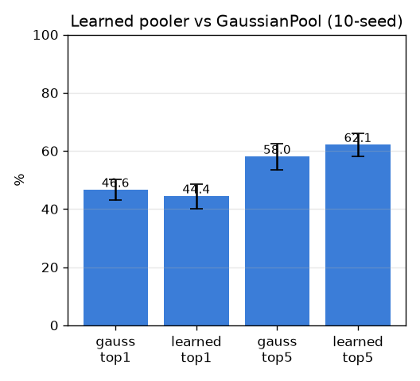

# 학습형 풀러 (PinCrossAttention) vs GaussianPool

- 날짜: 2026-06-27
- 커밋: `data-pivot @ e9781d2`
- 스크립트: `scripts/learned_pooler.py`  (10-seed, seed별 풀러 재학습)

## 목적
거리 기반 고정 풀러(GaussianPool) 대신 **어느 패치를 볼지 학습**하는 cross-attention 풀러가
핀 구조물에 집중해 미세 판별을 올리는지. SupCon 학습, exemplar 1-NN, cross-cadaver, paired 비교.

## 설정
| 항목 | 값 |
|---|---|
| 풀러 | PinCrossAttention (4-head, attn_dim 256, dropout 0.1) |
| 학습 | SupCon, class-balanced 48/step, Adam 1e-3, 250 step, seed별 재학습 |
| 평가 | exemplar 1-NN, 표본분할 10 seed |

## 결과 (selective top1/top5, mean±std)
| | GaussianPool | learned pooler |
|---|---|---|
| top1 | 46.6±3.6% | 44.4±4.2% |
| top5 | 58.0±4.4% | 62.1±4.0% |

## 판정 (paired)
- Δtop1 = -2.3±2.6%p (1/10 승), Δtop5 = +4.1%p (10/10)
- → **효과 불명확/노이즈**

## 시각 비교 (attention)
`outputs/pooler_attn.png` — 각 정답 샘플에 [GaussianPool | learned] 가중치 블렌딩. 가우시안은 핀 주변
원형, 학습형은 구조물 모양을 따라가는지 눈으로 확인.

## 해석 / 다음
- 도움되면 → 정식 풀러 채택, 데이터 늘려 추가 학습.
- 미미하면 → 작은 데이터에선 학습형 풀러도 포화 → **데이터가 결정적**(exp 013과 일관).
