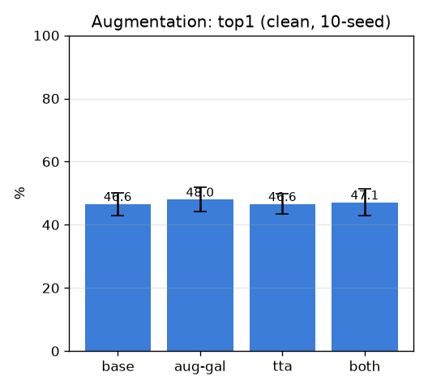
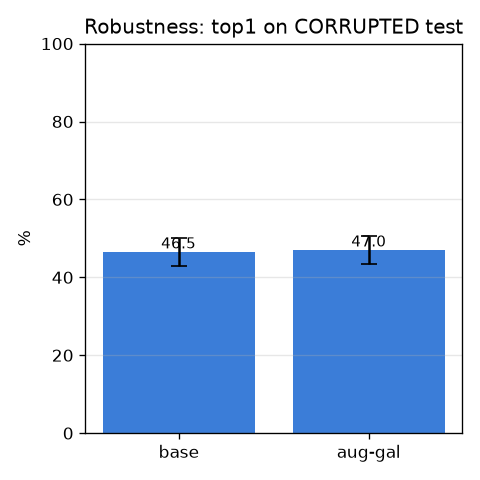

# 증강 — 정확도 + 견고성 (augmentation)

- 날짜: 2026-06-27
- 커밋: `data-pivot @ c730243`
- 스크립트: `scripts/augment_eval.py`  (frozen exemplar, 10-seed)

## 목적
배포 견고성: augment.py(조명·기하, q 따라감, K=4)를 **갤러리 확장 + 테스트 TTA**로 쓰고,
**강한 손상(어둡게+대비+색캐스트+노이즈=다른 카메라/조명)에 대한 robustness**를 측정.

## 정확도 (clean test, paired vs base)
| 설정 | top1 | top5 | Δtop1(paired) |
|---|---|---|---|
| base | 46.6±3.6% | 58.0±4.4% | +0.0 (0/10) |
| aug-gal | 48.0±3.8% | 59.1±4.2% | +1.4 (8/10) |
| tta | 46.6±3.2% | 58.6±5.0% | +-0.0 (4/10) |
| both | 47.1±4.2% | 60.6±4.8% | +0.4 (5/10) |

## 견고성 (손상 test에서 top1)
| 갤러리 | top1(손상) |
|---|---|
| base (원본만) | 46.5±3.5% |
| **aug-gallery** | **47.0±3.6%** |

손상 시 base는 clean 46.6%→46.5%로 추락, augmented gallery는 47.0% (Δ+0.5%p) → **배포 환경 변화에 대한 강건성** 지표.

## 해석 / 다음
- clean 정확도 이득은 작아도(증강은 새 시신을 안 만듦), **손상 robustness가 오르면 배포 가치 큼**.
- 다음: 핀 노이즈 강건성, val 기반 운영점 고정(정확도 보장), open-set 기권.
