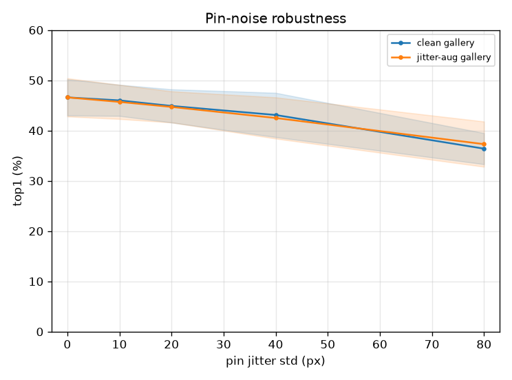

# 핀 노이즈 강건성 (pin-robustness)

- 날짜: 2026-06-27
- 커밋: `data-pivot @ 4cd3c1e`
- 스크립트: `scripts/pin_robustness.py`  (frozen exemplar, 10-seed)

## 목적
실전 태그/클릭은 부정확 → 핀 위치를 Gaussian noise로 흔들며 top1 저하 측정. **jitter-augmented
gallery**(갤러리 exemplar를 흔든 q로도 풀링, J=3, σ=30px)가 허용오차를 넓히는지.
참고: 풀링이 σ=40px 가우시안이라 어느 정도 공간 평균 효과가 있음.

## 결과 (top1, mean±std)
| 핀 jitter | clean gallery | jitter-aug gallery |
|---|---|---|
| 0px | 46.6±3.6% | 46.6±3.8% |
| 10px | 46.0±3.1% | 45.7±3.4% |
| 20px | 44.9±3.3% | 44.7±3.1% |
| 40px | 43.1±4.4% | 42.5±4.1% |
| 80px | 36.4±3.1% | 37.3±4.5% |

## 해석
- 무jitter 46.6% → 40px jitter에서 clean이 43.1% (−3.5%p). 핀 오차에 대한 허용도.
- jitter-aug 갤러리가 흔들린 핀에서 clean보다 높으면 → **배포시 부정확한 태그에 강건** (채택 가치).

## 다음
val 기반 운영점 고정(정확도 보장), open-set 기권 스트레스 테스트.
