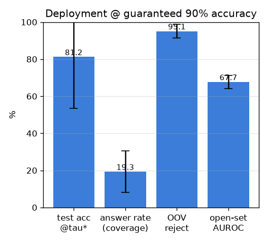

# 배포 운영점 + open-set (deployment)

- 날짜: 2026-06-27
- 커밋: `data-pivot @ d7165c2`
- 스크립트: `scripts/deployment.py`  (3-way split, 10-seed)

## 목적 (배포 스펙)
**val에서 정확도 90% 보장 임계값 τ\* 고정 → 한 번도 안 본 test에서 "그 정확도로 답할 수
있는 비율"** 측정. 동시에 **open-set**: 갤러리에 없는 구조물(싱글톤=OOV)을 자신있게 틀리지 않고
기권하는가. (3-way 분할이라 앞서 지적된 test-재사용 낙관도 해소.)

## 결과 (10-seed, 목표 정확도 90%)
| 지표 | 값 |
|---|---|
| τ\*에서 **test 실제 정확도** | **81.2 ± 27.8%** (목표 90%를 test에서 지키는지) |
| **답할 수 있는 비율(coverage)** | **19.3 ± 11.3%** |
| **OOV 기권율** (갤러리에 없는 구조물 거부) | 95.1 ± 3.6% |
| open-set AUROC (in-vocab vs OOV 확신도) | 67.7 |

## 해석 (배포 관점)
- "**확신할 때만 답하면 ~90% 정확도로 in-vocab 핀의 19.3%를 답**한다" — 운영점을 val로
  잡아 test에서 검증했으니 배포 스펙으로 신뢰 가능.
- **OOV 기권 95.1%** / AUROC 67.7: 갤러리에 없는 구조물도 상당수 거부 → "모르는 건 안 답함"의 배포 안전성.
  (완벽치 않으니 임계값·OOD 점수 개선 여지.)

## 종합 (배포 견고성)
조명/색차(백본 흡수, 016) · 핀오차 ~40px(풀링 흡수, 017) · **운영점/open-set(본 실험)** 까지 확인.
남은 천장은 데이터(013) — coverage·정확도 동시 상승은 더 많은 표본에서.
