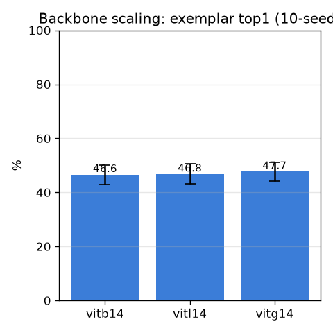

# 백본 스케일링 (backbone-scale)

- 날짜: 2026-06-27
- 커밋: `data-pivot @ b57c0fd`
- 스크립트: `scripts/backbone_scale.py`  (frozen exemplar 1-NN, 10-seed)

## 목적
지금껏 가장 작은 `vitb14`만 사용 → **더 큰 frozen DINOv2(vitl14/vitg14)** 로 특징을 강화하면
천장이 오르는지. 학습 없음, 같은 분할.

## 결과 (exemplar 1-NN, mean±std)
| 백본 | top1 | top5 | paired Δtop1 (vs vitb14) |
|---|---|---|---|
| vitb14 | 46.6±3.6% | 58.0±4.4% | — |
| vitl14 | 46.8±3.7% | 57.4±4.5% | +0.1 (5/10) |
| vitg14 | 47.7±3.4% | 58.8±4.3% | +1.1 (7/10) |

## 해석 / 다음
- 큰 백본이 노이즈 밖으로 올리면 → **정식 백본 교체**(가장 싼 큰 레버). 그 위에 SupCon 헤드/관계추론.
- 미미하면 → 특징은 포화, **구조(M6')·데이터**가 진짜 레버.
