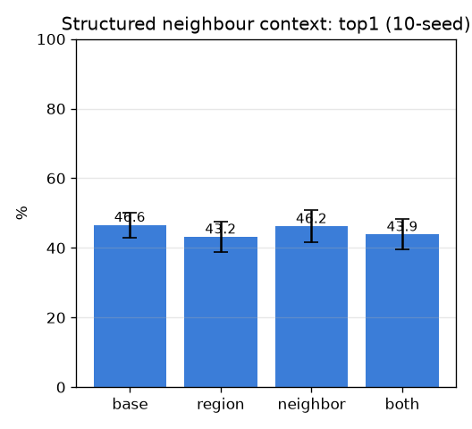

# M6' 1단계: 구조화된 이웃-영역 맥락 (relational-context)

- 날짜: 2026-06-27
- 커밋: `data-pivot @ 53d6b2d`
- 스크립트: `scripts/relational_context.py`

## 목적
exp 008(전역 CLS)은 top5만 올렸다. **구조화된** 관계 신호 — 핀 영역의 *인접 영역* 외형 — 이 top1을
올리는지 검증(=M6' 토대). DINO 패치를 K=12 영역으로 클러스터(공간가중 β=2.0), 인접 영역을
임베딩에 결합, frozen exemplar 1-NN.

## 결과 (10-seed, paired vs base)
| 변형 | top1 | top5 | Δtop1 |
|---|---|---|---|
| base | 46.6±3.6% | 58.0±4.4% | +0.0 (0/10) |
| region | 43.2±4.3% | 57.4±5.2% | -3.5 (0/10) |
| neighbor | 46.2±4.7% | 62.2±4.4% | -0.4 (4/10) |
| both | 43.9±4.3% | 61.1±5.0% | -2.8 (1/10) |

## 판정
- 베스트: **neighbor** Δtop1 -0.4%p (4/10) → **구조적 맥락도 top1 무효 → 데이터/학습이 레버**

## 다음
- top1 향상 시 → **full R-GCN**(scene_graph + RelationalGNN, SupCon 학습)로 관계 추론 본격화.
- 무효 시 → 구조도 데이터 한계를 못 넘음(학습형 풀러·맥락과 일관) → 데이터가 결정적.
