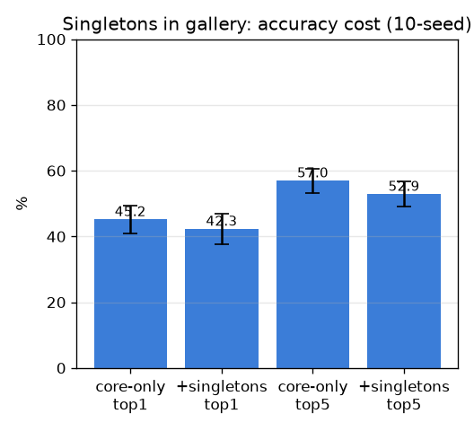

# A-1: 싱글톤 갤러리 포함 — 어휘 vs 정확도 (singleton-gallery)

- 날짜: 2026-06-27
- 커밋: `data-pivot @ 996a9ad`
- 스크립트: `scripts/singleton_gallery.py`  (frozen exemplar, 10-seed, page-split)

## 목적
평가는 ≥2 코어(215)만 쓰지만, 배포 갤러리에 **싱글톤 352개까지 넣으면 인식 어휘가 ~201→
~448로 확장**된다. 비용은 코어 테스트 정확도 하락(distractor 증가). 누수 방지 위해
싱글톤은 테스트 페이지 제외.

## 결과 (코어 테스트, 10-seed)
| 갤러리 | 어휘(클래스) | top1 | top5 |
|---|---|---|---|
| core-only | ~201 | 45.2±4.3% | 57.0±3.7% |
| **+singletons** | ~448 | 42.3±4.7% | 52.9±3.8% |

## 판정
- **어휘 201→448 (2.6배 확장)**, 코어 top1 비용 **Δ-2.9%p** (10/10 하락).
- 비용이 작으면 → 배포 갤러리엔 **싱글톤 포함**(거의 공짜로 인식 가능 구조물 2.6배). 단 싱글톤 자체의
  정확도는 측정 불가(인스턴스 1개).

## 다음
A-2(OCR 복구)로 더 많은 트리플 회수 시도.
