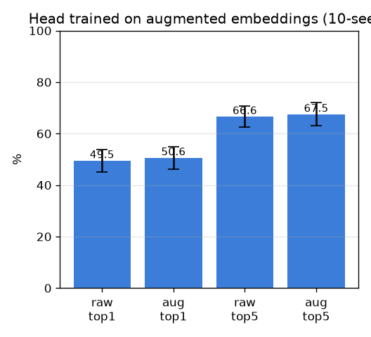

# 증강 임베딩으로 헤드 학습 (aug-head)

- 날짜: 2026-06-27
- 커밋: `data-pivot @ 58aff8b`
- 스크립트: `scripts/aug_head.py`

## 목적
exp 016은 갤러리만 증강. 데이터-굶주린 SupCon 헤드를 **트리플당 K=4 증강뷰로 훈련**하면 더 나은
metric을 배우는지 (paired vs 원본 학습 헤드). frozen 백본, exemplar 1-NN.

## 결과 (selective, mean±std, paired)
| 헤드 학습 | top1 | top5 |
|---|---|---|
| 원본만 | 49.5±4.3% | 66.6±4.0% |
| **+증강** | 50.6±4.4% | 67.5±4.5% |

## 판정
- paired Δtop1 +1.1%p (7/10), Δtop5 +0.9%p (6/10) → **효과 불명확 (증강은 새 다양성 없음)**

## 해석
- 증강은 새 *해부 다양성*을 안 만들므로(같은 시신·구조물), 헤드 학습 데이터를 늘려도 천장은 못 깸.
  이득이 있어도 robustness/정규화 수준. exp 013(데이터=천장)과 일관된 한계.
