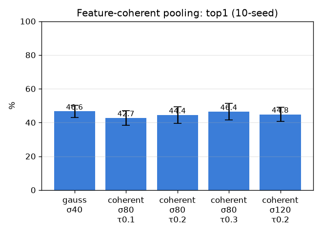

# Feature-coherent 풀링 (coherent-pool)

- 날짜: 2026-06-27
- 커밋: `data-pivot @ 0d1fbcc`
- 스크립트: `scripts/coherent_pool.py`

## 목적
GaussianPool은 거리로만 풀링 → 핀 구조물에 주변 조직이 섞임. **거리 × 핀패치 특징유사도**로 풀링해
구조물만 모으면(param-free region-grow) 미세 look-alike 판별이 좋아지는지.

## 결과 (exemplar 1-NN, 10-seed, paired vs gauss σ40)
| 풀링 | top1 | top5 | Δtop1 |
|---|---|---|---|
| gauss σ40 | 46.6±3.6% | 58.0±4.4% | +0.0 (0/10) |
| coherent σ80 τ0.1 | 42.7±4.2% | 56.4±4.1% | -3.9 (0/10) |
| coherent σ80 τ0.2 | 44.4±4.8% | 58.9±4.7% | -2.2 (1/10) |
| coherent σ80 τ0.3 | 46.4±4.9% | 60.7±4.7% | -0.2 (4/10) |
| coherent σ120 τ0.2 | 44.8±4.2% | 59.1±4.9% | -1.9 (1/10) |

## 판정
- 베스트: **coherent σ80 τ0.3** Δtop1 -0.2%p (4/10) → **효과 불명확/노이즈**

## 해석
- 도움되면 → 정식 풀러 채택(학습 없이 미세판별↑). 무효면 → DINO 패치는 이미 구조-국소적이라 거리풀링으로
  충분(특징선택이 추가 정보를 안 줌).
