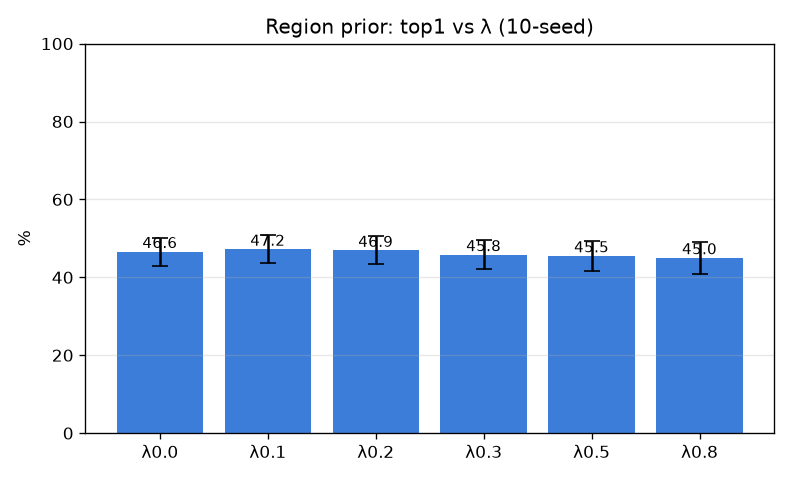

# 부위-조건부 사전 (region-prior)

- 날짜: 2026-06-27
- 커밋: `data-pivot @ 18bd642`
- 스크립트: `scripts/region_prior.py`

## 목적
`score = 외형유사도 + λ·cos(CLS_test, 부위프로토타입)`. region(CLS)을 *concat 특징*(exp 008)이
아니라 *베이지안 사전*으로 결합 → 교차-부위 혼동을 칠 수 있는지. λ 고정 스윕(test-튜닝 아님).

## 결과 (exemplar 1-NN, 10-seed, paired vs λ=0)
| λ | top1 | top5 | Δtop1 |
|---|---|---|---|
| 0.0 | 46.6±3.6% | 58.0% | +0.0 (0/10) |
| 0.1 | 47.2±3.6% | 59.6% | +0.5 (6/10) |
| 0.2 | 46.9±3.6% | 61.0% | +0.2 (4/10) |
| 0.3 | 45.8±3.7% | 62.1% | -0.8 (3/10) |
| 0.5 | 45.5±3.8% | 63.0% | -1.1 (2/10) |
| 0.8 | 45.0±4.1% | 65.0% | -1.6 (2/10) |

## 판정
- 베스트 λ=0.1: Δtop1 +0.5%p (6/10) → **효과 불명확 (교차-부위 혼동은 소수)**

## 해석
- 교차-부위 혼동(예: cerebellum↔cecum)은 칠 수 있으나, 주된 혼동(같은-부위 동맥↔정맥)은 부위가 같아
  못 가름. 이득이 작으면 → 대부분의 혼동이 *같은 부위 내 미세판별*이라는 또 다른 확인.
