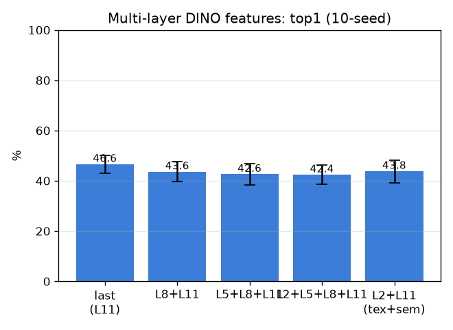

# 다층 DINO 특징 (multilayer)

- 날짜: 2026-06-27
- 커밋: `data-pivot @ a4f7f63`
- 스크립트: `scripts/multilayer.py`

## 목적
마지막 층(의미)만 쓰던 걸, **초기층(질감·결) + 후기층(의미)** 을 핀에서 풀링·concat. 동맥/정맥의
미세 질감 차이를 초기층이 잡는지. exemplar 1-NN, paired.

## 결과 (10-seed, paired vs last-layer)
| 층 조합 | top1 | top5 | Δtop1 |
|---|---|---|---|
| last (L11) | 46.6±3.6% | 58.0% | +0.0 (0/10) |
| L8+L11 | 43.6±4.0% | 50.8% | -3.1 (0/10) |
| L5+L8+L11 | 42.6±4.3% | 49.2% | -4.1 (0/10) |
| L2+L5+L8+L11 | 42.4±3.9% | 48.6% | -4.2 (0/10) |
| L2+L11 (tex+sem) | 43.8±4.5% | 51.8% | -2.9 (0/10) |

## 판정
- 베스트: **L2+L11 (tex+sem)** Δtop1 -2.9%p (0/10) → **효과 불명확/노이즈**
