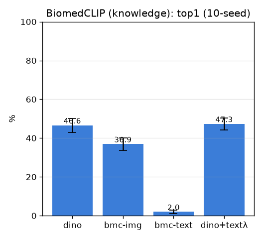

# BiomedCLIP — vision-language 지식 (biomedclip)

- 날짜: 2026-06-27
- 커밋: `data-pivot @ 7774c6a`
- 스크립트: `scripts/biomedclip.py`

## 목적
같은-부위 look-alike 구분에 필요한 *해부 지식*을 의료 CLIP 텍스트 인코더로 끌어옴. 핀 주변 크롭으로
DINO / BiomedCLIP-이미지 / zero-shot 텍스트 / DINO+텍스트사전 비교. (dino+text는 seed별 λ=상한 신호.)

## 결과 (10-seed, paired vs dino)
| 방법 | top1 | top5 | Δtop1 |
|---|---|---|---|
| dino | 46.6±3.6% | 58.0% | +0.0 (0/10) |
| bmc-img | 36.9±3.3% | 49.0% | -9.7 (0/10) |
| bmc-text | 2.0±0.9% | 9.4% | -44.6 (0/10) |
| dino+textλ | 47.3±3.1% | 58.7% | +0.7 (7/10) |

## 해석
- bmc-text(0shot)/dino+text가 dino를 넘으면 → **지식이 실재 보완 신호**. 둘 다 낮으면 → BiomedCLIP도
  박리 사진엔 OOD(논문 figure 학습).
