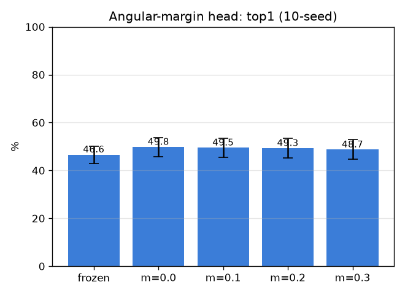

# 각마진 헤드 (arcface-head)

- 날짜: 2026-06-27
- 커밋: `data-pivot @ 7774c6a`
- 스크립트: `scripts/arcface_head.py`

## 목적
SupCon 헤드(마진 없음) 위에 **additive angular margin** `cos(θ+m)` 를 positive 쌍에 부과해 same-region
look-alike 경계를 더 날카롭게. m=0 = 기존 SupCon → 깨끗한 paired ablation. exemplar 1-NN, 10-seed.

## 결과 (mean±std, paired)
| margin m | top1 | top5 | Δ vs frozen | Δ vs m=0 |
|---|---|---|---|---|
| 0 (SupCon) | 49.8±4.0% | 66.7% | +3.1 (10/10) | +0.0 (0/10) |
| 0.1 | 49.5±4.0% | 66.6% | +2.9 (10/10) | -0.3 (2/10) |
| 0.2 | 49.3±4.2% | 66.4% | +2.6 (8/10) | -0.5 (3/10) |
| 0.3 | 48.7±4.1% | 66.1% | +2.0 (8/10) | -1.1 (1/10) |

(frozen top1 46.6±3.6%)

## 판정
- 베스트 m=0.1: vs SupCon(m=0) Δtop1 -0.3%p (2/10) → **각마진 추가 이득 없음 (SupCon로 충분)**

## 해석
- 마진이 도우면 → 경계가 데이터로 underdetermined가 아니라 *손실 형태*가 레버. 안 도우면 → 천장은
  여전히 데이터(같은-부위 판별 정보가 외형에 없음), 손실 trick 무효.
