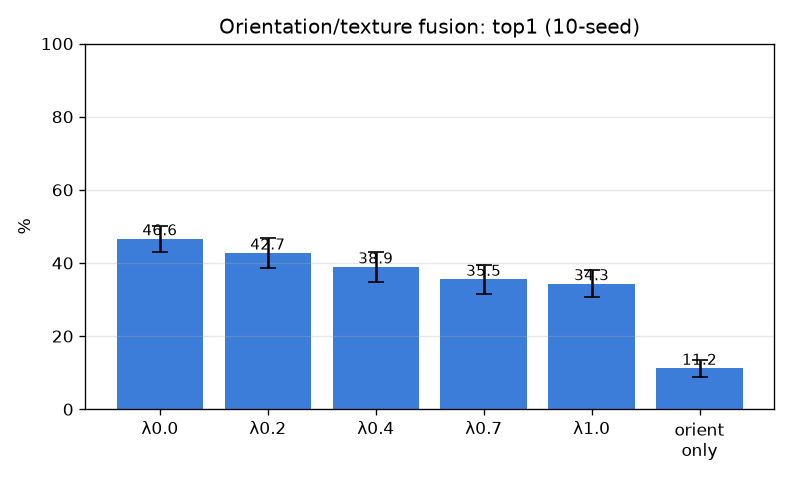

# 국소 방향/질감 기술자 (orientation)

- 날짜: 2026-06-27
- 커밋: `data-pivot @ 7774c6a`
- 스크립트: `scripts/orientation.py`

## 목적
DINO 의미특징이 뭉개는 *미세 결(grain)* — 혈관벽(매끈)·신경(케이블 줄무늬)·근육(이방성 섬유) — 을
핀 패치에서 직접 기술. 다중스케일 HOG식 방향 히스토그램 + 구조텐서 coherence/이방성. 외형점수와
`score = sim_dino + λ·sim_orient` 융합(고정 λ). exemplar 1-NN, 10-seed.

## 결과 (paired vs λ=0)
| λ | top1 | top5 | Δtop1 |
|---|---|---|---|
| 0.0 | 46.6±3.6% | 58.0% | +0.0 (0/10) |
| 0.2 | 42.7±4.2% | 56.5% | -4.0 (0/10) |
| 0.4 | 38.9±4.0% | 52.6% | -7.8 (0/10) |
| 0.7 | 35.5±3.9% | 48.2% | -11.2 (0/10) |
| 1.0 | 34.3±3.7% | 45.3% | -12.4 (0/10) |

- 방향 기술자 단독: top1 11.2±2.4% (≈무작위 0.47% 대비)

## 판정
- 베스트 λ=0.2: Δtop1 -4.0%p (0/10) → **방향 기술자 추가 이득 없음**

## 해석
- 융합이 도우면 → 미세 결은 외형에 *없던* 보완 신호. 무효면 → DINO가 이미 그 질감을 흡수했거나,
  핀 한 점의 국소 결이 같은-부위 판별엔 부족(=데이터 천장 재확인).
