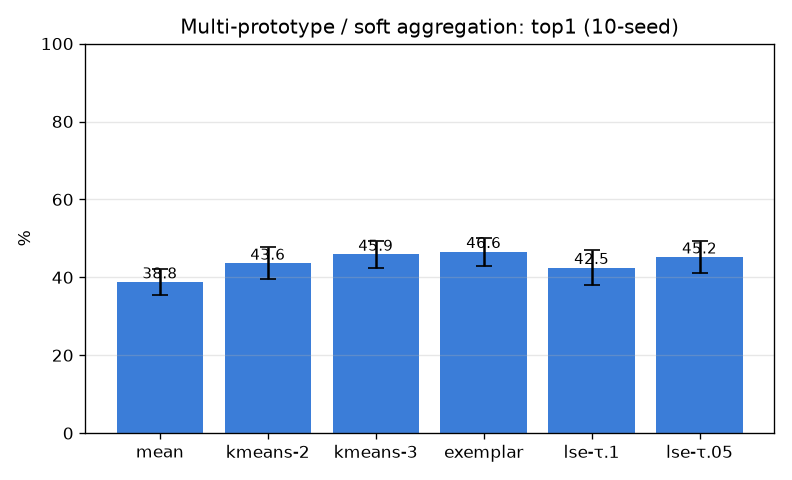

# 다중 프로토타입 / soft 집계 (multiproto)

- 날짜: 2026-06-27
- 커밋: `data-pivot @ 7774c6a`
- 스크립트: `scripts/multiproto.py`

## 목적
교훈 = exemplar(전체 max) ≫ mean(뭉갬). 그 사이 — 클래스별 k-means K개 부분프로토타입(다중모드)과
soft log-sum-exp 집계(τ가 mean↔max 보간) — 가 plain max를 넘는지. 10-seed, paired vs exemplar.

## 결과 (paired vs exemplar)
| 집계 | top1 | top5 | Δtop1 |
|---|---|---|---|
| mean | 38.8±3.4% | 55.8% | -7.9 (0/10) |
| kmeans-2 | 43.6±4.1% | 57.0% | -3.1 (0/10) |
| kmeans-3 | 45.9±3.5% | 57.5% | -0.8 (0/10) |
| exemplar | 46.6±3.6% | 58.0% | +0.0 (0/10) |
| lse-τ.1 | 42.5±4.6% | 55.0% | -4.1 (0/10) |
| lse-τ.05 | 45.2±4.0% | 56.7% | -1.5 (0/10) |

## 판정
- 베스트(비-exemplar): **kmeans-3** Δtop1 -0.8%p (0/10) → **exemplar-max가 여전히 최선**

## 해석
- exemplar가 최선이면 → 갤러리가 작아(2-core) 부분프로토/soft가 줄 여지가 없음, max가 디테일 보존엔
  최적. soft가 약간 도우면 → 노이즈 완화 여지(추후 큰 갤러리에서 재평가).
