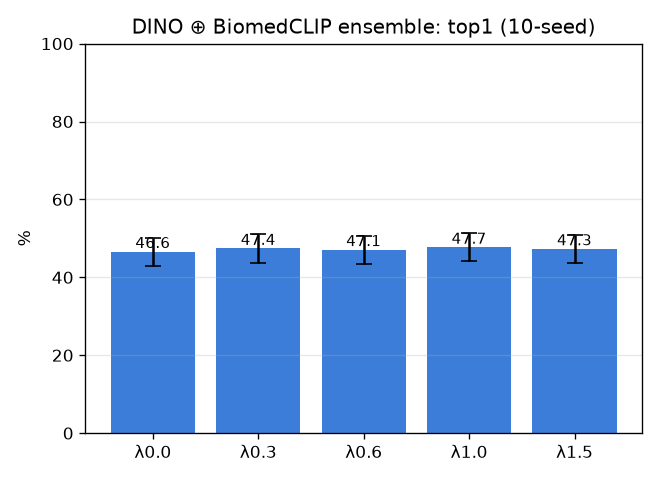

# 다양백본 앙상블 (ensemble)

- 날짜: 2026-06-27
- 커밋: `data-pivot @ 7774c6a`
- 스크립트: `scripts/ensemble.py`

## 목적
bmc-img 단독(36.9)은 약하지만 *다른 분포(의료 figure)* 로 학습돼 오류가 상보적일 수 있음 →
`score = sim_dino + λ·sim_bmc` 융합이 DINO 단독을 넘는지. 고정 λ, 10-seed, paired.

## 결과 (paired vs λ=0=DINO)
| λ | top1 | top5 | Δtop1 |
|---|---|---|---|
| 0.0 | 46.6±3.6% | 58.0% | +0.0 (0/10) |
| 0.3 | 47.4±3.6% | 58.9% | +0.7 (6/10) |
| 0.6 | 47.1±3.6% | 58.5% | +0.4 (4/10) |
| 1.0 | 47.7±3.6% | 58.6% | +1.0 (5/10) |
| 1.5 | 47.3±3.6% | 57.8% | +0.7 (4/10) |

## 판정
- 베스트 λ=1.0: Δtop1 +1.0%p (5/10) → **상보성 부족 — 앙상블 무효**

## 해석
- 향상하면 → 두 백본이 상보적, 값싼 앙상블이 레버. 무효면 → bmc-img가 박리 사진엔 약해 노이즈만 추가.
