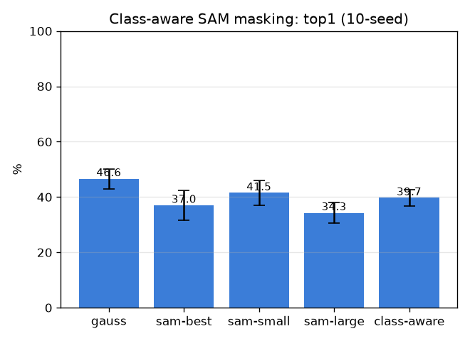

# 클래스-인지 적응 SAM 마스킹 (sam-classaware)

- 날짜: 2026-06-27
- 커밋: `data-pivot @ ae577d0`
- 스크립트: `scripts/sam_classaware.py`

## 목적
DX4는 SAM을 한 설정으로만 써서 기각. 이번엔 **마스크 스케일을 구조종류에 따라 가변**:
가는 구조(동맥/정맥/신경/관)→small 마스크, 큰 조직(근육/샘/뼈)→large 마스크. SAM multimask 3스케일
중 선택해 DINO 패치를 masked-pool. **싼 프로브 = 오라클 라우팅(참 thin/bulk)** — 상한조차 못 넘으면 기각.

## 결과 (exemplar 1-NN, 10-seed, paired vs gauss)
| 정책 | top1 | top5 | Δtop1 |
|---|---|---|---|
| gauss | 46.6±3.6% | 58.0% | +0.0 (0/10) |
| sam-best | 37.0±5.5% | 53.3% | -9.7 (0/10) |
| sam-small | 41.5±4.6% | 54.8% | -5.2 (1/10) |
| sam-large | 34.3±3.6% | 56.7% | -12.4 (0/10) |
| class-aware | 39.7±3.0% | 57.9% | -6.9 (0/10) |

## 구조종류별 top1 (gauss vs class-aware)
| 종류 | gauss | class-aware |
|---|---|---|
| 가는 구조(thin) | 47.0±6.1% | 39.4±5.0% |
| 큰 조직(bulk) | 46.3±2.8% | 39.9±4.0% |

## 판정
- 베스트(비-gauss): **sam-small** Δtop1 -5.2%p (1/10) → **마스킹 무효 — Gaussian이 최선 (DX4 재확인)**

## 해석
- 오라클 라우팅조차 못 넘으면 → 마스크-풀링은 본질적으로 영역 평균이라 디테일을 뭉갬(008/015/020/024/030
  과 동일 서명). thin에서만 미세 이득이 보이면 → 가는 구조 한정 추적 마스크는 추후 가치 있을 수 있음.
