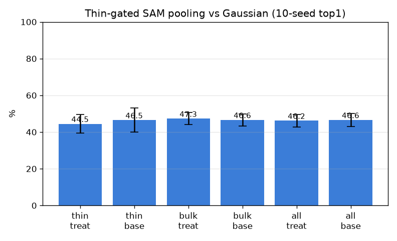

# 033 — thin-게이팅 SAM 풀링 (SAM 최종 판정)

- 날짜: 2026-06-27
- 스크립트: `scripts/sam_thingate.py` (검수: `scripts/sam_masks_preview.py`, montage = `*.private.png`)

## 설계 (마스크 검수 + exp 032에서 수렴)
- **thin**(동맥/정맥/신경/관): SAM이 잡는 독립 객체 → 가중 = feather(SAM 마스크)×핀-Gaussian.
  SAM 최소 마스크가 6% 초과로 헐거우면(예: 굵은 정맥) 그 항목은 Gaussian fallback.
- **bulk**(근육/뼈/뇌/샘): 내부 경계 없음 → 순수 핀-Gaussian(=baseline). SAM 미사용.
- treatment는 thin 항목에서만 baseline과 다름. **사전 등록 채택: thin paired Δ>0 & ≥7/10.**

## 마스크 검수 (이 폴더의 `masks_preview_*.private.png`)
- thin(혈관/신경)은 SAM이 구조를 잘 따라감(0.1–2%). bulk(근육/뇌/뼈)는 전체를 삼키거나(17–69%)
  강제로 자르면 임의의 원이 됨 → 균일 조직엔 SAM이 찾을 내부 경계가 없음을 시각적으로 확인.

## 결과 (exemplar 1-NN, 10-seed, paired)
| 그룹 | feather×Gauss | pure Gauss | paired Δtop1 |
|---|---|---|---|
| thin (249) | 44.5±5.1% | 46.5±6.6% | -2.0 (1/10) |
| bulk (352) | 47.3±3.3% | 46.6±3.2% | +0.7 (6/10) |
| all (601) | 46.2±3.5% | 46.6±3.6% | -0.4 (3/10) |

(thin 마스크 적용 216건 / 헐거워 fallback 33건. bulk가 treat≠base인 건 bulk 질의가 갤러리 전체와
1-NN 매칭하므로 thin 갤러리 임베딩 변화의 간접 효과 — 노이즈.)

## 판정
- thin Δtop1 **-2.0%p (1/10)** → **기각.** 시각적으로 옳은 혈관/신경 마스크조차 게이팅하면 thin 인식을
  *악화*. 예쁜 마스크가 임베딩을 못 바꾸는 008/024/026 패턴의 극단. **SAM/세그 방향 전 형태 종결**
  (point-prompt DX4, class-aware oracle 032, thin-gate 033). 천장은 풀링이 아니라 데이터.
