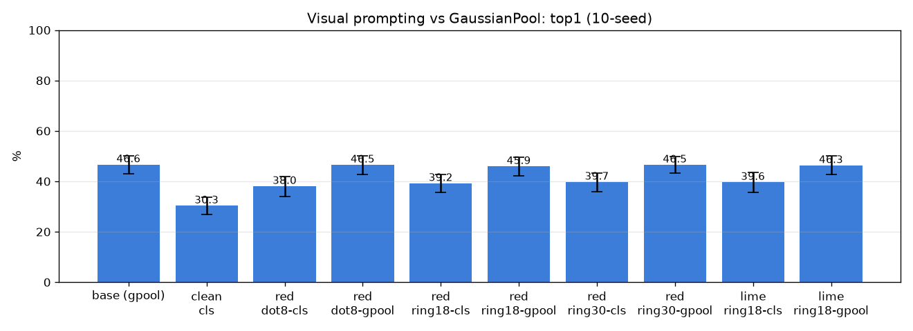

# 034 — Visual prompting (backbone 입력단 q 주입)

- 날짜: 2026-06-27
- 커밋: `data-pivot @ 7c647e9`
- 스크립트: `scripts/visual_prompt.py`

## 목적
지금껏 q는 항상 readout 단계(깨끗한 이미지의 grid를 Gaussian/SAM 풀링)에서만 조건화됐다. 여기선 q를
**backbone 입력**에 주입 — 핀 위치에 마커(빨간 점/고리)를 그려 DINO에 통과 → CLS/국소 토큰 readout.
공간 풀링 평면과 직교한 마지막 모델 축. 학습 0, exemplar 1-NN, 10-seed paired vs GaussianPool.

## 결과 (paired vs base gpool)
| 방법 | top1 | top5 | Δtop1 |
|---|---|---|---|
| base (gpool) | 46.6±3.6% | 58.1% | +0.0 (0/10) |
| clean-cls | 30.3±3.5% | 64.7% | -16.3 (0/10) |
| red-dot8-cls | 38.0±3.9% | 66.2% | -8.6 (0/10) |
| red-dot8-gpool | 46.5±3.7% | 57.5% | -0.1 (4/10) |
| red-ring18-cls | 39.2±3.5% | 66.3% | -7.4 (1/10) |
| red-ring18-gpool | 45.9±3.6% | 55.7% | -0.7 (1/10) |
| red-ring30-cls | 39.7±3.7% | 66.0% | -7.0 (0/10) |
| red-ring30-gpool | 46.5±3.3% | 55.1% | -0.2 (3/10) |
| lime-ring18-cls | 39.6±4.0% | 65.9% | -7.0 (0/10) |
| lime-ring18-gpool | 46.3±3.7% | 55.4% | -0.3 (2/10) |

## 판정 (사전 등록: 최선 VP Δ>0 & ≥8/10)
- 최선 VP = **red-dot8-gpool** Δtop1 -0.1%p (4/10) → **기각 — backbone 입력 주입도 무효, 모델 축 전체 소진 → 천장은 데이터**
- 다중비교: 비-baseline 9개 비교 → Holm-Bonferroni 하에서도 ≥8/10 + 유효크기여야 채택.

## 해석
- 음성이면 → backbone 입력 주입조차 무효 = **모델 축 전체(풀링 안+밖) 소진**, "데이터 한계" 결론 완성.
- 양성이면 → 천장이 사실 *q 조건화 위치* 문제였다는 반전, 9개 phase 해석 재검토.
