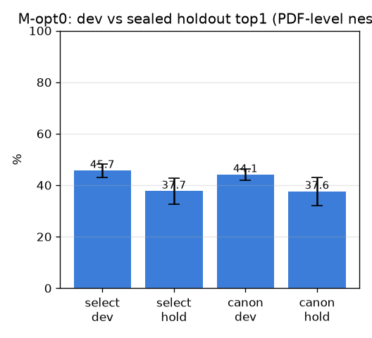

# M-opt0 — 평가 정화 (HP-selection 누수 측정)

- 날짜: 2026-06-27
- 커밋: `data-pivot @ 970ca26`
- 스크립트: `scripts/mopt0.py`  (PDF-level nested, 5-fold, holdout 봉인)

## 목적
split 누수는 DX1이 닫음. dev에서 (σ,rule) 고르고 *봉인 holdout*(unseen PDF)에서 평가. **gap을 두
원인으로 분해** — HP-selection 누수 vs cross-cadaver 일반화 갭(섞으면 오독).

## 결과 (5-fold mean±std)
| | dev(코어 내 page-split) | sealed holdout(unseen PDF) | gap |
|---|---|---|---|
| 선택(σ,rule) | 45.7±2.6% | 37.7±5.1% | 8.0 |
| canonical(σ40,exemplar) | 44.1±2.2% | 37.6±5.4% | 6.5 |

- 선택된 config: {(80, 'exemplar'): 5} (선택 holdout 37.7 ≈ canonical holdout 37.6)

## 분해 (핵심)
- **HP-selection 누수 = gap_sel − gap_can = 1.5pp** → **🟢 누수 거의 없음 — paired Δ·30개 숫자 신뢰**
  (dev에서 σ80을 골라도 holdout에선 σ40과 동일 → 선택이 일반화 이득 0; 006/009 정합.)
- **cross-cadaver 갭 = 6.5pp** → **유의** — page-split이 same-cadaver 매칭으로 부풀음; cross-cadaver는 더 낮음.
  page-level split은 *같은 카데바의 다른 페이지*를 갤러리에 허용 → exemplar가 same-cadaver 외형
  (염색·조명·절개결) 매칭으로 덕을 봄. unseen PDF엔 없음 → 진짜 일반화 top1은 ~37.6.

## 결론 / 시사
- 게이트(HP-selection) 통과: **paired Δ 비교는 유효**, 30개 실험의 *상대* 결론 안전.
- 단 **절대 ~50은 cross-cadaver 기준 낙관**(같은-카데바 leakage). 배포 관련 정직한 수치는
  page-split ~44–50 과 cross-cadaver ~37.6 를 *함께* 보고해야 함(DX1을 exemplar로 정밀화).
- 037+ 최적화는 dev/holdout 규율 유지, holdout(cross-cadaver) 수치 병기.
