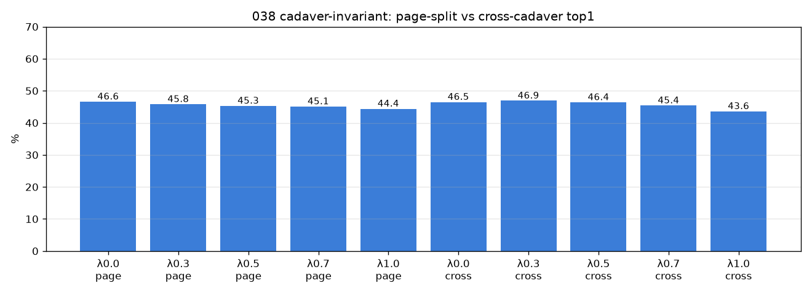

# 038 — Cross-cadaver 갭 분해(A3) → 조건부 cadaver-invariant 정규화(A1)

- 날짜: 2026-06-27
- 커밋: `data-pivot @ a38c29f`
- 스크립트: `scripts/cadaver_invariant.py`  (★PRIMARY = cross-cadaver)

## A3-1 — 색조 기여 분해 (먼저, 결정적)
- 원본: page-split **46.6** → cross-cadaver **46.5** (갭 **0.1pp**)
- Reinhard 색정규화: page-split 46.2 → cross-cadaver 46.3
- **색조 recovery = -0.2pp** (< 갭 절반) → A1 **사전 중단**

## A3-2 — same-cadaver 매칭 (갭의 정체)
- 최근접 exemplar가 같은 PDF인 비율: **0.3%**
- 1-NN 정확도: same-cadaver 매칭 **53.6%** vs diff-cadaver **43.9%** (차 = same-cadaver 이득)

## A1 — cadaver-invariant 정규화 (클래스균등 μ, λ 스윕)
| λ | page-split top1 | cross-cadaver top1 | cross cov |
|---|---|---|---|
| 0.0 | 46.6±3.6% | 46.5±6.2% | 57.2% |
| 0.3 | 45.8±3.5% | 46.9±5.5% | 57.2% |
| 0.5 | 45.3±3.6% | 46.4±5.2% | 57.2% |
| 0.7 | 45.1±3.4% | 45.4±5.5% | 57.2% |
| 1.0 | 44.4±3.8% | 43.6±6.7% | 57.2% |

- 베스트 λ=0.3: cross-cadaver **+0.4pp** (2/5 fold), page-split 손해 −0.8pp, **순이득 -0.4pp**

## 판정 (사전등록)
🔴 A3 사전중단 (색조 기여 < 갭절반 = 해부변이, 953 한계) — A1 결과는 탐색용, 미채택

## 해석
- frac_same·acc 차이가 same-cadaver 외형 leakage를 정량화. 색조 recovery가 갭을 설명하면 정규화로
  배포 성능을 올릴 수 있고, 못 하면 해부 변이(953 한계)다. cross-cadaver를 primary로 올려야만 보이는 레버.
