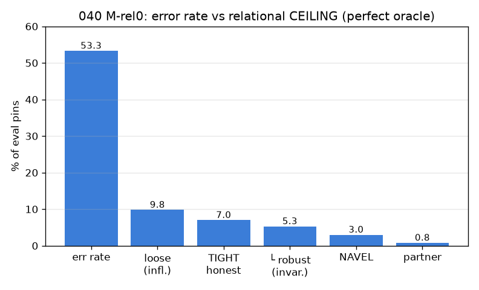
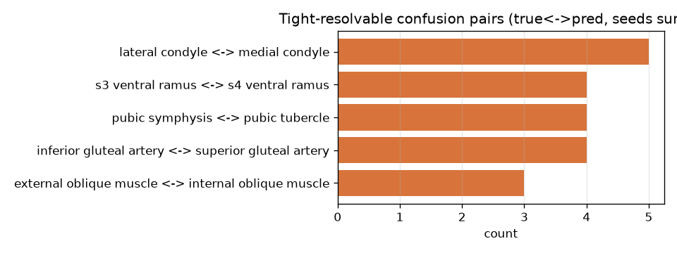

# 040 / M-rel0 — 관계추론 축 Feasibility (선결 게이트)

- 날짜: 2026-06-27
- 커밋: `data-pivot @ 06e281c`
- 스크립트: `scripts/confusion_pairs.py`
- 핸드아웃: exp-040 관계추론 축 (§2.1 혼동쌍 식별 + §4 M-rel0)

## 목적
핀을 독립 판별 p(y|I,q) → **해부 지식 그래프 제약 하 동시추론** p(y₁..yₙ|I,{qᵢ},G).
동기: artery↔vein은 외형으론 안 갈리지만(DX3) 상대위치+규칙(NAVEL)으론 갈림. 핸드아웃이
인정한 세 균열(#1 stage-1 / #2 image≠anatomy / #3 LLM) **이전의 선결 조건 = crack #0**:
관계 항이 발화하려면 한 페이지에 *관계 이웃*이 다른 핀으로 존재해야 한다.

## 방법
현 베스트 엔진(frozen dinov2_vitb14@518 → GaussianPool σ40 → exemplar class-max cosine)으로
10-seed page-split 예측 → 혼동행렬. 각 **오답** 핀에 대해, 같은 페이지의 다른 코어 핀이
정답 라벨의 *관계 이웃*(같은 수식어·다른 구조; NAVEL 다발 또는 인접 동부위 근육)인지 검사.
co-present 이웃이 있으면 = **관계로 구제 가능**. 이웃 집합은 오라클(배포 시 모든 핀 존재).

## 결과
- 엔진: 215-way exemplar **top1 46.6±3.6%** (10-seed). 오류율 **53.3%** (wrong 804/1509).
- 해결가능 혼동쌍 TIGHT(S≥3, 진짜 해부명 공유·중복제외): **5**개
  (loose 프록시는 13개로 셈 — 차이 = near-duplicate·우연한 generic수식어 공유 거짓양성).
  임계초과 전체 112개 중 혼동질량의 4.4%.

| 빈도 | 관계유형 | 혼동쌍 (정답 ↔ 예측) |
|---|---|---|
| x5 | dir↔ | lateral condyle ↔ medial condyle |
| x4 | – | s3 ventral ramus ↔ s4 ventral ramus |
| x4 | – | pubic symphysis ↔ pubic tubercle |
| x4 | dir↔ | inferior gluteal artery ↔ superior gluteal artery |
| x3 | dir↔ | external oblique muscle ↔ internal oblique muscle |

- 방향의존(lateral/medial·sup/inf·deep/superficial 등, crack#2 정조준) 쌍: **3/5**
  → **invariant(좌우반전 robust) 비율 40.0%**.

### ⭐ 천장 (완벽 오라클 하 global top1 최대 이득 — 점점 정직하게)
| 경로 | 값 |
|---|---|
| loosest 프록시 (중복·우연 거짓양성 포함) | 148/1509 = +9.8pp |
| 'true에 해결가능 이웃 존재' (여전히 느슨) | 106/1509 = +7.0pp |
| └ 그중 방향의존 (crack#2가 침식) | 26/106 = 24.5% |
| NAVEL 다발 이웃 존재 | 46/1509 = +3.0pp |
| 예측=co-present 파트너 (교과서 swap) | 12/1509 = +0.8pp |
| **⭐ 현실 천장** (pred=파트너 & true≤rank3) | **6/1509 = +0.4pp = 0.6 pins/seed** |

> 관계 항은 *tie-breaker*(§2.3: 외형을 압도하면 안 됨)다. 따라서 모델이 true↔파트너를 swap했고,
> 파트너가 페이지에 co-present이며, 외형이 true를 top3 안에 둔 경우에만 실제로 교정 가능 →
> **현실 천장 +0.4pp(0.6 pins/seed)**. 이게 M-rel1이 실제로 측정할 양이고, σ=3.6pp
> 분할노이즈와 비교된다.

## 판정 (사전등록 게이트)
🔴 축 사전종결 — 현실 천장 +0.4pp(0.6 pins/seed)로 σ=3.6pp 분할노이즈에 묻힌다. crack #0(관계이웃 희소: 페이지 58% 단일핀)가 #1/#2/#3 이전에 축을 막고, 남는 해결가능 쌍의 24.5%는 방향의존(crack#2 정조준). M-rel1을 돌려도 측정가능한 양성 불가 → 데이터(다중핀·다발 동시라벨 페이지) 선확보 전엔 평가 무의미. 깨끗한 음성(핸드아웃 §5 '오라클 평탄=축폐기'를 한 단계 더 싸게).

## 해석 (천장이 무너지는 4단계)
1. **crack #0 (관계 이웃 부재)**: 페이지의 58%가 단일 핀, NAVEL 다발 동시핀은 vessel/nerve의
   13%(전체 4.8%)뿐. femoral triangle(N+A+V 한 페이지)은 QuizLink에서 *규칙이 아니라 예외*.
2. **거짓양성 제거**: loose +9.8pp → near-duplicate(`l phrenic ↔ phrenic`=동일구조),
   우연한 generic 공유(`internal jugular vein ↔ internal oblique muscle`=목 vs 복부), CN 마커
   공유(`accessory ↔ vagus`가 "cn"만 공유 = 두 동맥이 "artery" 공유와 동급), OCR(`cn v`→`vein`)을
   걷어내면 진짜 해결가능 쌍은 **5개**뿐.
3. **crack #2 (방향의존)**: 그 5쌍 중 3쌍(lateral/medial condyle, sup/inf gluteal,
   ext/int oblique)이 방향의존 → 핸드아웃 최대 위험(2D투영·좌우반전)이 정조준. invariant 잔여 40.0%.
4. **tie-breaker 제약**: 관계가 외형을 압도하지 않으려면 true가 이미 top3이어야 → 현실 천장은
   **+0.4pp = 0.6 pins/seed**로, σ=3.6pp 노이즈에 **완전히 묻힌다**.

- 두 병목(crack #0·#2)은 *데이터 구조*(한 사진에 한 구조 핀 + 방향 모호)의 함수지 모델·그래프의
  함수가 아니다 → 추론을 아무리 정교화해도 못 넘는다. 핸드아웃 §0.3 '운명의 질문'은 **M-rel1조차
  돌릴 필요 없이 M-rel0 천장에서** 답이 나온다: 현 데이터에선 관계가 외형을 *교정*할 표본 자체가 없다.
- **프로젝트 through-line과 일치**: 데이터가 천장(§2). 관계추론도 모델축(027-034)·신뢰도축(037)처럼
  현 953에서 소진 — 단, 이 축은 *데이터 확장 시 되살아날* 유일한 축이다(다중핀 페이지가 crack #0을
  직접 푼다). → **데이터 확장(다발 동시라벨) 후 재평가** 대상으로 보류, 폐기 아님.
