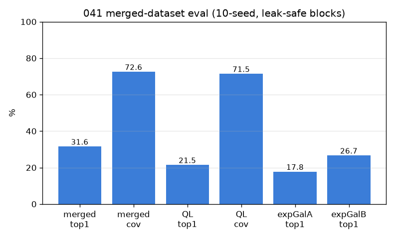

# 041 — 정밀 재평가 (clean merged dataset)

- 날짜: 2026-06-27
- 커밋: `data-pivot @ 7547a7b`
- 스크립트: `scripts/eval_merged.py` · 데이터: `data/merged_final` (2230 triples / 502 classes / 710 photos)
- 엔진: frozen dinov2_vitb14@518 → GaussianPool σ40 → exemplar class-max cosine, 10-seed
- ★ 누수안전: photo-twin 블록(exact∪corr≥0.90)을 분할단위로 — QuizLink 49% BlueLink 중복 누수 차단

## 결과 (10-seed mean±std)
| 비교 | top1 | top5 | coverage | end-to-end |
|---|---|---|---|---|
| **1. Merged pooled** (502-way) | **31.6±4.1** | 47.6±2.3 | 72.6% | 22.9 |
| 2. QuizLink-only (195-way) | 21.5±4.7 | 34.9±6.0 | 71.5% | 15.4 |

random baseline: merged 0.2% / QL 0.51%

### 3. ⭐ 확장갤러리 효과 (쿼리=QuizLink test 고정, paired, 누수안전)
| 갤러리 | top1 | coverage |
|---|---|---|
| A: QuizLink-train only | 17.8±5.0 | 72.0% |
| B: QuizLink-train + BlueLink | 26.7±6.3 | 82.1% |

- **Δtop1 8.91pp (10/10)** | **Δcoverage 10.12pp (10/10)**

## 해석
- merged는 502-way(난도↑)임에도 random(0.2%)의 159배.
- 확장갤러리: BlueLink 추가가 QuizLink 인식 top1/coverage를 올림(Δtop1 8.91).
- coverage가 데이터 확장의 직접 레버(exp 038/039 가설) — merged cov 72.6% vs QL 71.5%.
