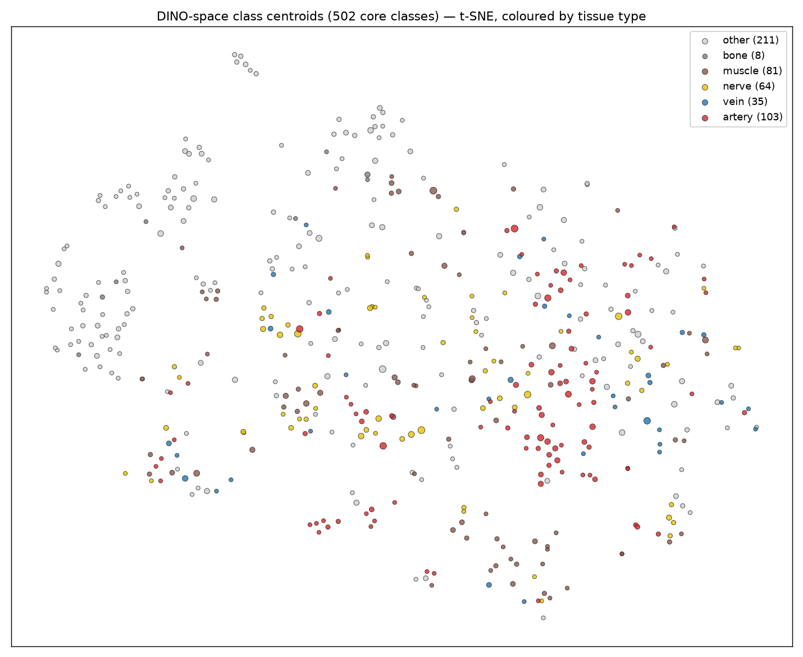
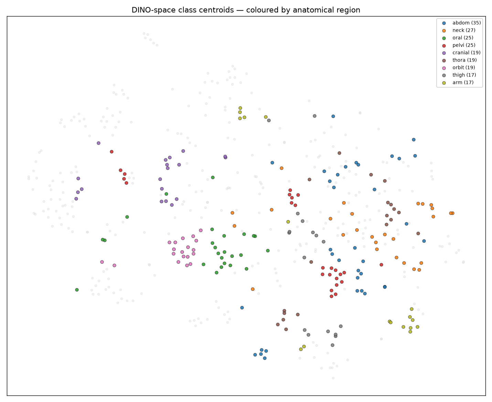
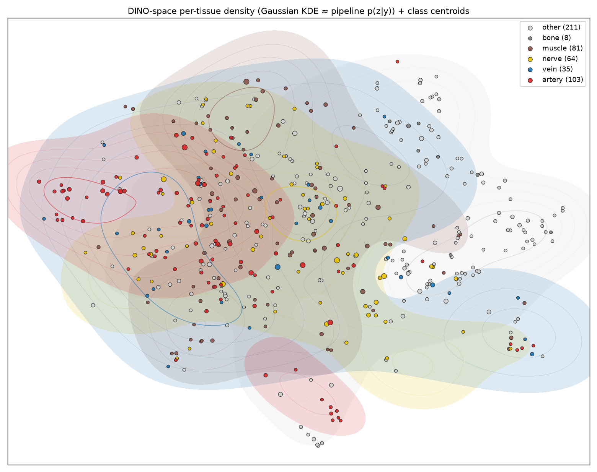
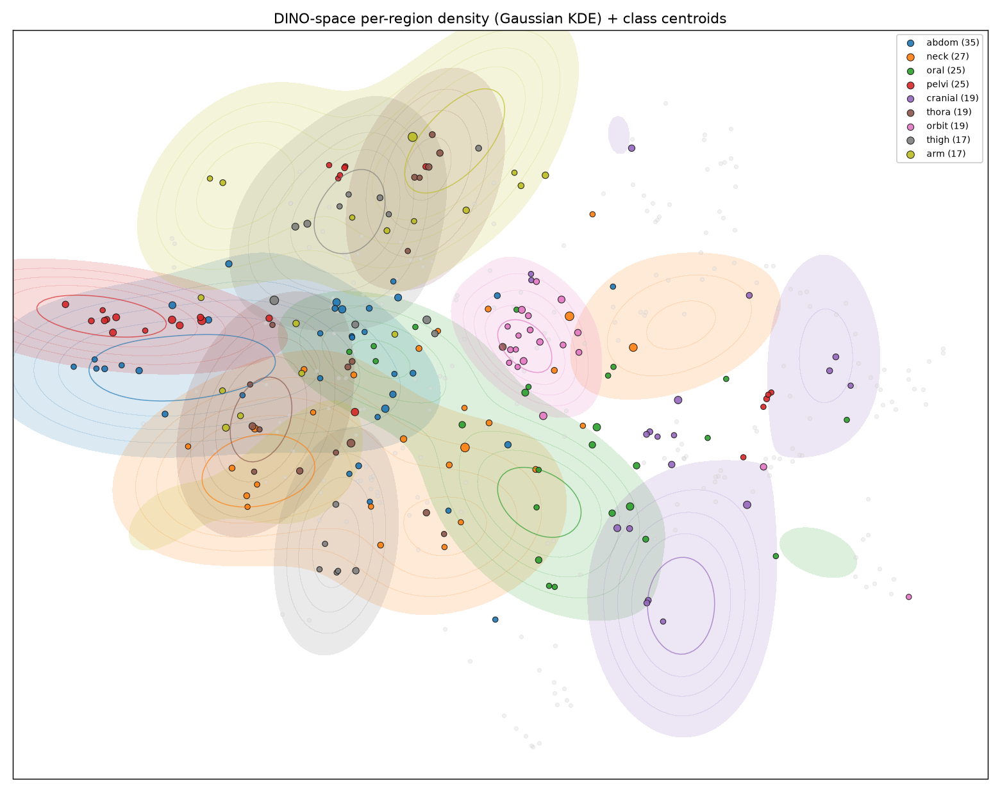

# 042 — EDA: DINO-space 클래스 중심점 기하

- 날짜: 2026-06-28
- 커밋: `data-pivot @ 40ff0f8`
- 스크립트: `scripts/eda_dino_space.py` · 데이터: `data/merged_final` (2230 triples / 502 core classes)
- 엔진: frozen dinov2_vitb14@518 → GaussianPool σ40 → 클래스 평균 = 중심점, t-SNE(cosine) 2D

## 2D 중심점 분포 + 밀도

> 밀도 figure: instance를 Gaussian KDE로(파이프라인의 p(z|y) 추정방식, exp037) 채운 등고선 + 클래스
> 중심점(얇은 진한 테두리). 조직형(위): artery(빨강)·vein(파랑) 밀도가 같은 영역에 겹침 = DX3.
> 부위(아래): 부위별 밀도가 더 분리돼 뭉침(DINO가 부위로 조직화).

## 기하 통계
| 항목 | 값 |
|---|---|
| 조직형: within 0.514 / across 0.519 → 분리 | **-0.005** (≈0, 안 갈림) |
| 부위: within 0.684 / across 0.586 → 분리 | **0.098** (강함) |
| artery↔vein 같은부위 쌍 중심 cos (DX3) | **0.878** (n=13) |
| 클래스내 응집 (instance→centroid cos) | 0.905 |

### 조직형별 클래스내 응집
- muscle: 0.918
- artery: 0.915
- nerve: 0.912
- vein: 0.903
- other: 0.893
- bone: 0.882

## 해석 — DINO-space는 *부위*로 조직화되지 *조직형*으론 안 된다
- **조직형 분리 ≈ -0.005 (0)**: 같은 조직형(artery들끼리)이 다른 조직형보다 가깝지
  **않다** → DINO는 "동맥/정맥/신경"을 분리축으로 인코딩하지 않음.
- **부위 분리 = 0.098 (강함)**: 같은 부위(orbit, pelvis…) 구조끼리 뚜렷이 뭉침
  (figure에서 orbit·cranial·pelvi 군집 가시) → DINO는 *국소 맥락(부위)*을 인코딩.
- **artery↔vein 쌍 cos 0.878**: 같은 부위 동맥↔정맥은 중심점이 거의 동일 → DX3 정량 확증.
- **함의**: "top5 좋고(부위 맞힘) top1 나쁜(부위내 미세정체성)" 시그니처의 기하학적 정체. 부위내 동맥/정맥/신경
  분리가 천장 — 외형 밖 정보(관계추론 040) 또는 더 많은 데이터가 필요한 지점.
