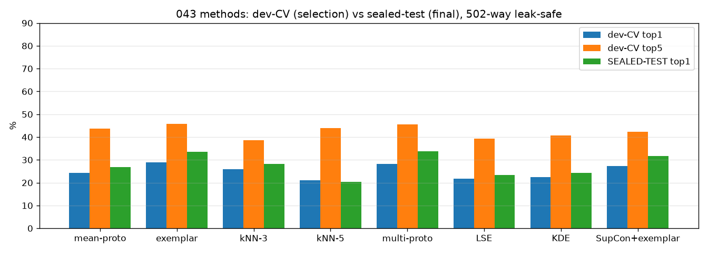
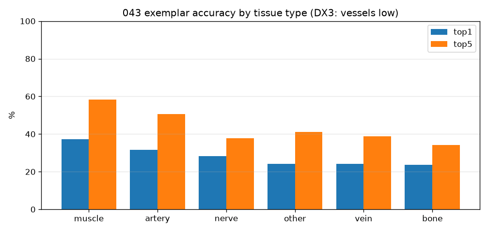
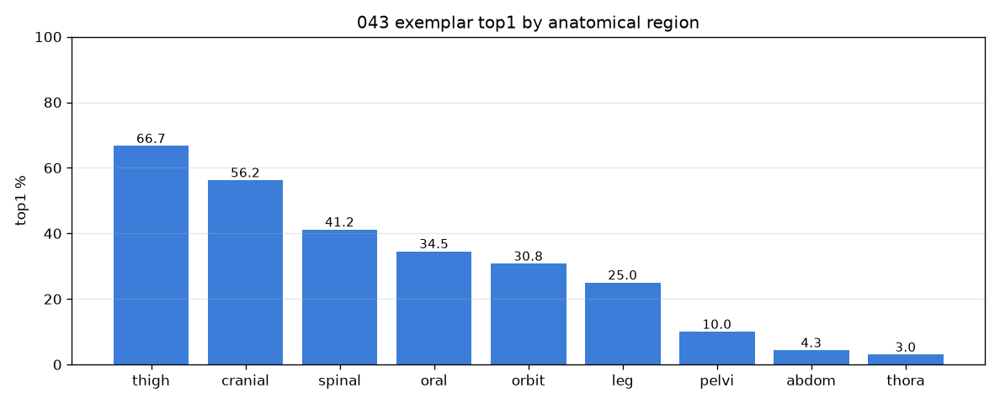
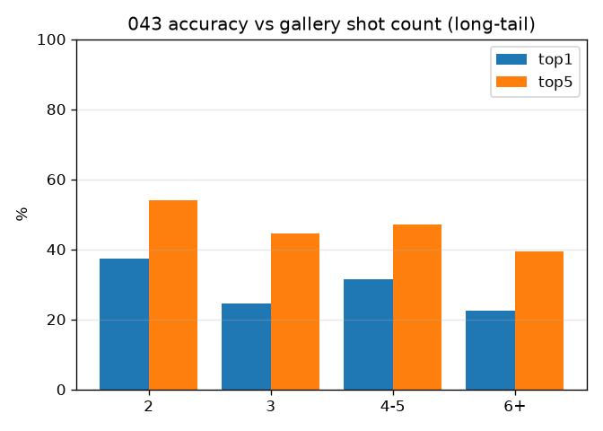
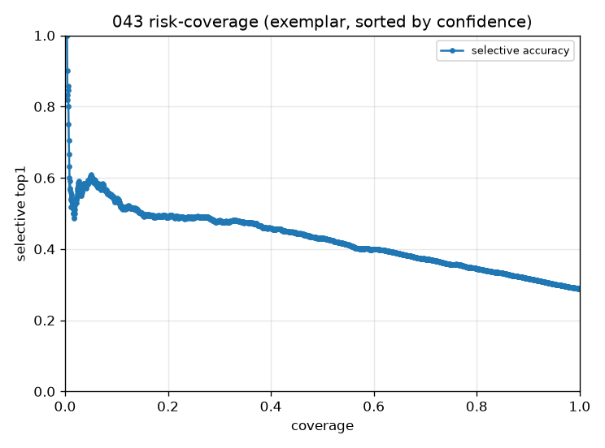
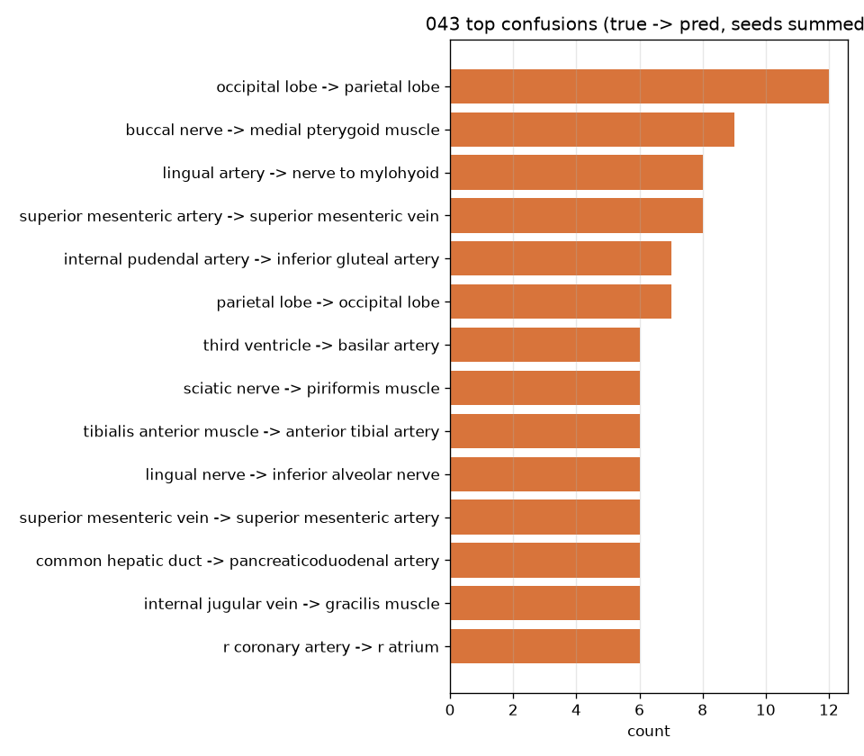
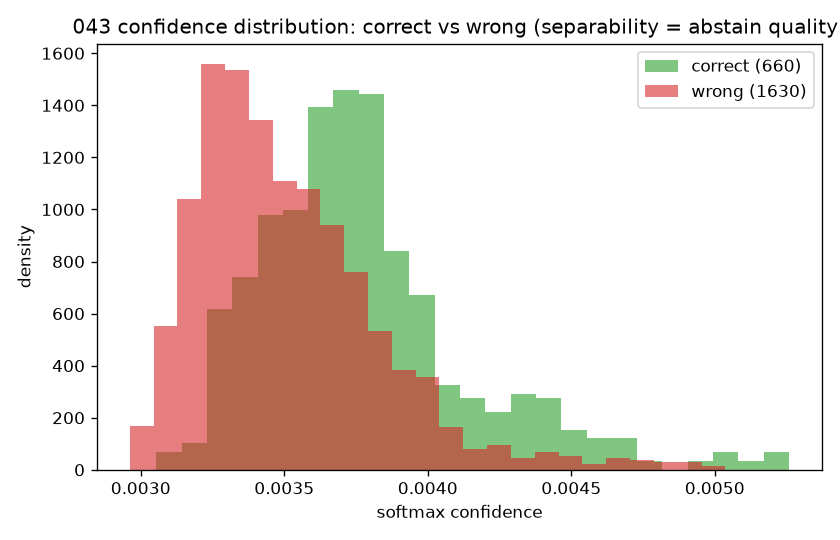

# 043 — 모델 방법론 스윕 (clean merged, 중첩 멀티시드 3-way)

- 날짜: 2026-06-28
- 커밋: `data-pivot @ 0dfd819`
- 스크립트: `scripts/model_sweep.py` · 데이터 `data/merged_final` (1551 core / 502 cls)
- 엔진: frozen dinov2_vitb14@518 → GaussianPool σ40 (캐시)
- ★ 프로토콜(§1.7): **dev 1214 / 봉인 test 337** photo-block. 선택은 dev 10-seed CV,
  **최종은 봉인 test 1회**. dev로 best를 고르고 → 그 수치만 test로 보고(부트스트랩 CI).

## 방법 비교 (dev-CV = 선택 / 봉인 TEST = 최종)
| 방법 | dev-CV top1 | dev top5 | dev cov | **봉인 TEST top1** |
|---|---|---|---|---|
| mean-proto | 24.4±2.5 | 43.7 | 63.7 | **26.8** |
| exemplar | 28.9±3.0 | 45.8 | 63.7 | **33.5** |
| kNN-3 | 26.0±2.9 | 38.6 | 63.7 | **28.3** |
| kNN-5 | 21.1±3.0 | 43.9 | 63.7 | **20.4** |
| multi-proto | 28.3±2.7 | 45.6 | 63.7 | **33.8** |
| LSE | 21.8±2.9 | 39.2 | 63.7 | **23.4** |
| KDE | 22.4±3.0 | 40.7 | 63.7 | **24.2** |
| SupCon+exemplar | 27.4±3.2 | 42.2 | 63.7 | **31.6** |

- **dev-선택 best = `exemplar` → 봉인 TEST top1 33.5** (95% CI 27.5–39.4, cov 79.8);
  dev-CV는 28.9 → **HP-선택 낙관 -4.6pp** (exp036 ~1.5pp와 정합).

## 진단 — 어디서 막히나
### 조직형별 (DX3: 혈관/신경 낮음)
| 조직형 | n | top1 | top5 |
|---|---|---|---|
| muscle | 379 | 37 | 58 |
| artery | 609 | 32 | 51 |
| nerve | 273 | 28 | 38 |
| other | 883 | 24 | 41 |
| vein | 108 | 24 | 39 |
| bone | 38 | 24 | 34 |

## 핵심
- **봉인 test 최종: `exemplar` top1 33.5** (CI 27.5–39.4) — 선택누수 제거한 정직 수치.
  dev-CV 28.9와의 낙관 -4.6pp는 작아 결론 안전.
- 집계방법: dev best = exemplar (옛 953에서 exemplar≫mean였는데 누수안전 502에서도 재확인).
- **SupCon 학습헤드는 도움 안 됨** (test 31.6 vs exemplar 33.5) — 옛 +2.6은 부분 누수기반.
- **오류의 42%가 같은 조직형 내 혼동** — 조직형 *내* 미세정체성이 천장(DX3, exp042 기하와 일치).
- shot 역설: 빈번 클래스가 더 어려움(흔한 혈관/근육 혼동) — 데이터-부족 아닌 내재 난이도.
