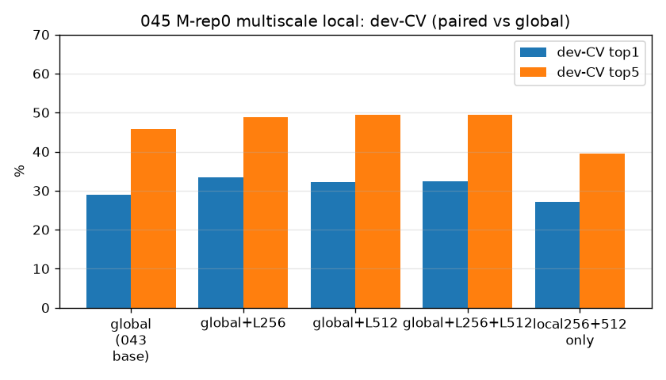
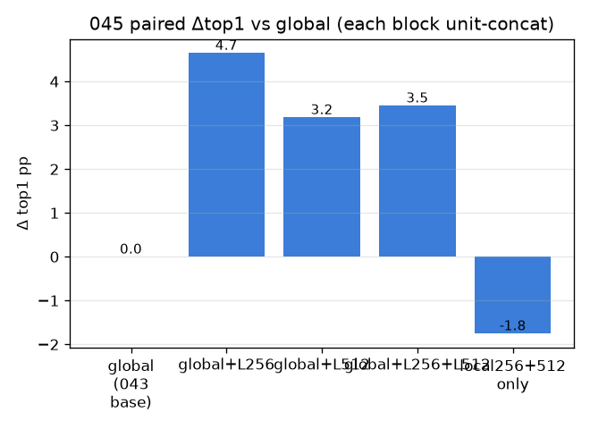
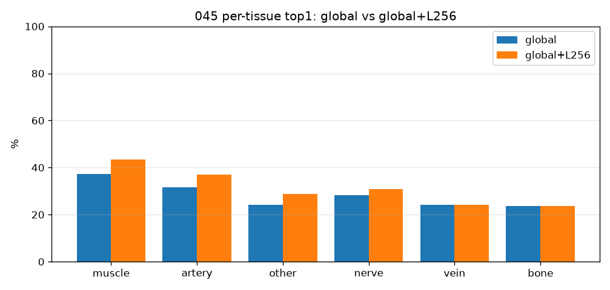
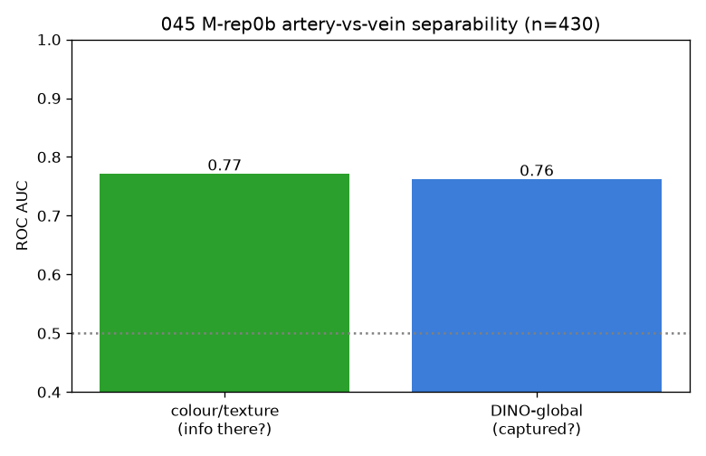

# 045 — 표현 게이트: 멀티스케일 고해상 로컬 (M-rep0) + 조직oracle·색 (M-rep0b)

- 날짜: 2026-06-28
- 커밋: `data-pivot @ e40b4f5`
- 스크립트: `scripts/multiscale_local.py` · 데이터 `data/merged_final` (clean 502, dev 1214/test 337 봉인)
- 학습 0 — 재임베딩만. dev 10-seed CV 선택 + 봉인 test 1회 (§1.7).

## M-rep0 — 멀티스케일 고해상 로컬 (paired Δ vs global)
| variant | dev-CV top1 | top5 | Δtop1 | wins |
|---|---|---|---|---|
| global (043 base) | 28.9±3.0 | 45.8 | +0.0 | 0/10 |
| global+L256 | 33.5±2.9 | 48.9 | +4.65 | 10/10 |
| global+L512 | 32.1±3.5 | 49.5 | +3.18 | 10/10 |
| global+L256+L512 | 32.3±3.3 | 49.5 | +3.45 | 10/10 |
| local256+512 only | 27.1±3.5 | 39.4 | -1.75 | 2/10 |

- **dev-선택 best = `global+L256` → 봉인 TEST top1 36.1** (CI 30.1–42.0) vs global 33.5.
- 채택: 🟢 **병목=해상도 확정 (첫 균열).** 멀티스케일 채택 → M-rep1(공간)로 가산 가능.

## M-rep0b — 두 상한 분해
- **(a) 조직-oracle**: 조직을 완벽히 알면 top1 35.3 (base 28.9) → **Δ +6.4pp**
  (조직 게이트 가치 있음 → M-rep2).
- **(b) artery↔vein 분리도**: 저수준 색·텍스처 AUC **0.771** | DINO-global **0.762** (n=430).
  - 색 AUC>0.65 & DINO≈0.5 → 정보는 있으나 DINO가 못 봄 → **M-rep3(색주입) 유효**.
  - 색 AUC≈0.5 → 정보 문제(DX3 최악), 정적사진에 단서 없음 → ④인간천장.

## 핵심
- M-rep0(해상도)가 다른 모든 표현법의 전제 — 통과: 고해상이 미세 ID를 살림.
- 조직-oracle Δ +6.4pp = 계층 게이트(M-rep2)의 상한 (cross-tissue 56%만 공략).
- 색 AUC 0.771 vs DINO 0.762 = 정보 vs 표현 분해.
