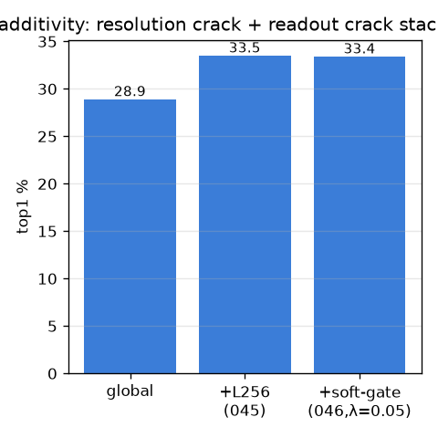
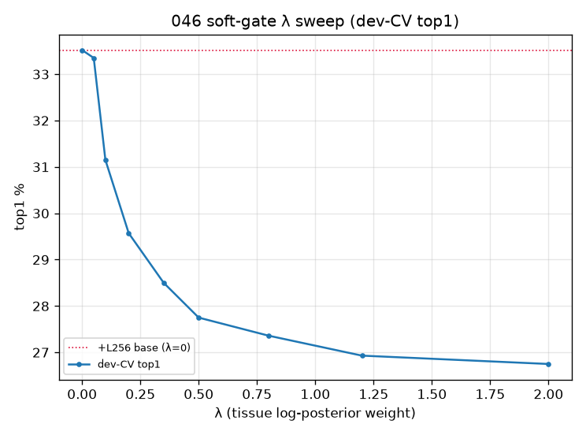
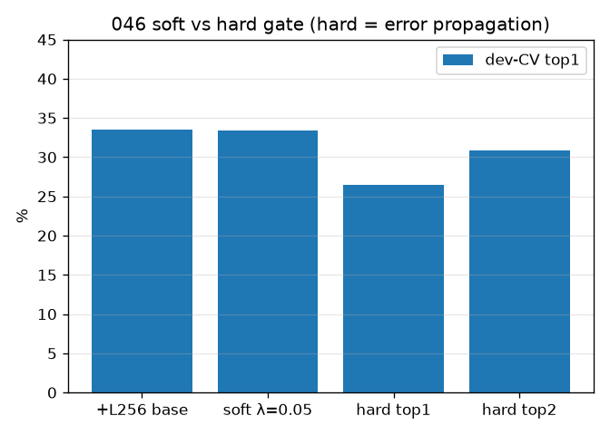
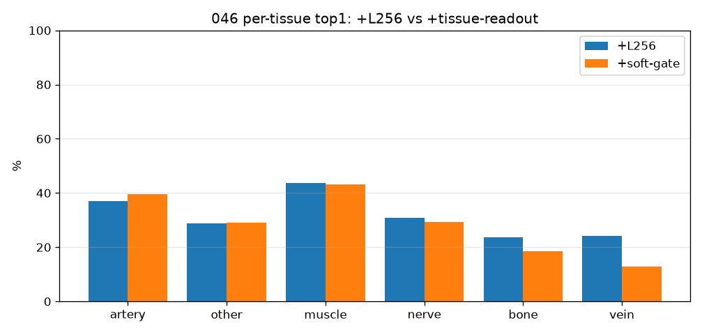

# 046 — M-rep2: 조직-인식 soft-gate readout (global+L256 위)

- 날짜: 2026-06-28 · 커밋 `main @ 597077f` · `scripts/multiscale_readout.py`
- clean 502 (dev 1214/test 337 봉인), dev 10-seed CV λ선택 + 봉인 test 1회 (§1.7).
- readout: `final(c) = s_exemplar(c) + λ·log P(tissue(c)|q)`, 6-way LogReg head (train fold만 — 누수안전).

## 가산 (resolution crack + readout crack)
| 단계 | dev-CV top1 | Δ | wins |
|---|---|---|---|
| global only | 28.9±3.0 | — | — |
| +L256 (045) | 33.5±2.9 | +4.65 vs global | 10/10 |
| **+soft-gate λ=0.05 (046)** | **33.4±2.7** | **-0.17 vs +L256** | **3/10** |
| +conf-gate λ=0.05 | 33.9±2.5 | +0.35 vs +L256 | 6/10 |
| +hard-gate top1 | 26.5 | -7.01 | 0/10 |
| +hard-gate top2 | 30.9 | -2.64 | 0/10 |

- **봉인 TEST: global 33.5 → +L256 36.1 → +soft-gate 35.7** (CI 29.7–41.6).
- Stage-1 조직 정확도 **65.5%** (게이트 품질). soft ≫ hard (33.4 vs 26.5) = hard-gate 오류전파 확인.
- 채택: 🔴 **미가산 — 실제 조직분류기(불완전)로는 oracle +6.4를 못 살림.** Stage-1 정확도가 병목.

## 핵심
- 045 진단("readout이 조직정보 버림")의 *실현* — 조직-oracle 상한 +6.4pp 중 실제 -0.17pp 실현.
- soft-gate가 hard-gate를 이김 = Stage-1 오류전파를 soft가 흡수(설계 의도대로).
- per-tissue: artery +2, other +0, muscle -1, nerve -1 (조직-혼동이 풀리는 곳).
