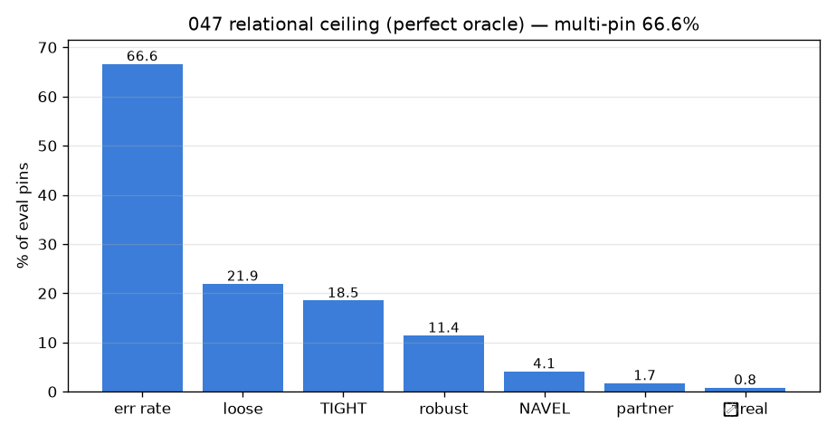
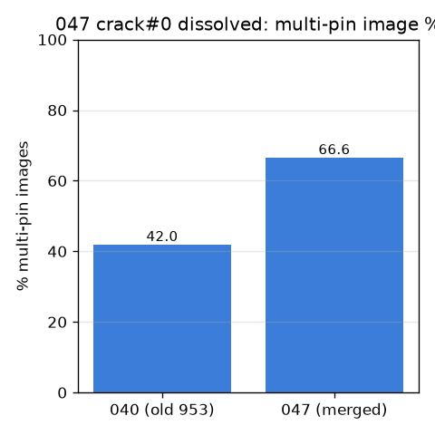
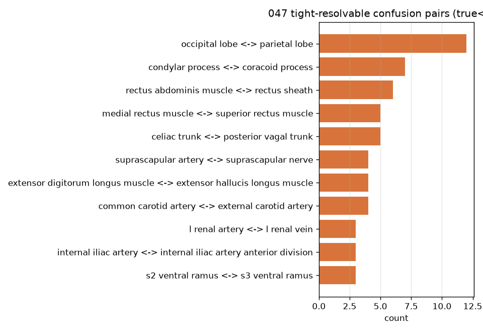

# 047 — M-rep0c: 관계축 부활 (040 재실행, clean merged + global+L256)

- 날짜: 2026-06-28 · 커밋 `main @ 597077f` · `scripts/multiscale_relational.py`
- 040은 crack#0(페이지 58% 단일핀)로 🔴 STOP했으나 "데이터 확장 시 부활" 보류였다. BlueLink 수확으로
  **다중핀 이미지 66.6%**(단일핀 58%→33.4%) — crack#0 직접 해소.
- 동일 oracle 천장(학습 0)을 새 데이터·새 엔진(global+L256)으로 재측정. 사전등록 게이트 040과 동일.

## 결과
- 엔진 global+L256 exemplar **top1 33.5±2.9%** (block-split), 오류율 66.6% (1525/2290).
- 해결가능 쌍 TIGHT(S≥3): **11** (loose 15), invariant 63.6%, 방향의존 4.

| 빈도 | 관계유형 | 혼동쌍 (정답 ↔ 예측) |
|---|---|---|
| x12 | – | occipital lobe ↔ parietal lobe |
| x7 | – | condylar process ↔ coracoid process |
| x6 | – | rectus abdominis muscle ↔ rectus sheath |
| x5 | dir↔ | medial rectus muscle ↔ superior rectus muscle |
| x5 | dir↔ | celiac trunk ↔ posterior vagal trunk |
| x4 | NAVEL✓ | suprascapular artery ↔ suprascapular nerve |
| x4 | – | extensor digitorum longus muscle ↔ extensor hallucis longus muscle |
| x4 | dir↔ | common carotid artery ↔ external carotid artery |
| x3 | NAVEL✓ | l renal artery ↔ l renal vein |
| x3 | dir↔ | internal iliac artery ↔ internal iliac artery anterior division |
| x3 | – | s2 ventral ramus ↔ s3 ventral ramus |

### ⭐ 천장 (완벽 오라클)
| 경로 | 040 (old) | 047 (merged) |
|---|---|---|
| TIGHT (true에 이웃 존재) | +7.0pp | +18.5pp |
| NAVEL 다발 이웃 | +3.0pp | +4.1pp |
| 예측=co-present 파트너 | +0.8pp | +1.7pp |
| **⭐ 현실 천장** (pred=파트너 & true≤rank3) | **+0.4pp (0.6/seed)** | **+0.8pp (1.8/seed)** |

## 판정 (사전등록 게이트, 040과 동일)
🔴 **STOP** — 🔴 여전히 사전종결 — 다중핀이 66.6%로 늘어도 현실 천장 +0.8pp(1.8 pins/seed)가 σ=2.9pp에 묻힌다. crack#0은 풀렸으나 crack#2(방향의존 38.1%)·tie-breaker 제약이 남아 관계가 외형을 교정할 표본이 부족. 데이터 더, 또는 다발 동시라벨 페이지 타게팅 필요.

## 핵심
- crack#0(다중핀 부재)은 66.6%로 **해소**됐다 — 040 보류 조건 충족.
- 현실 천장 040 +0.4pp → 047 +0.8pp (1.8 pins/seed). σ에 묻힘 — 잔여 crack#2/tie-breaker가 병목.
