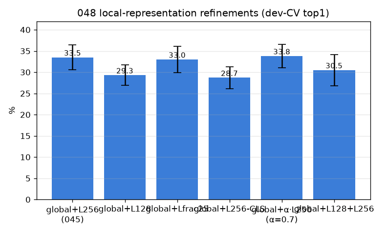
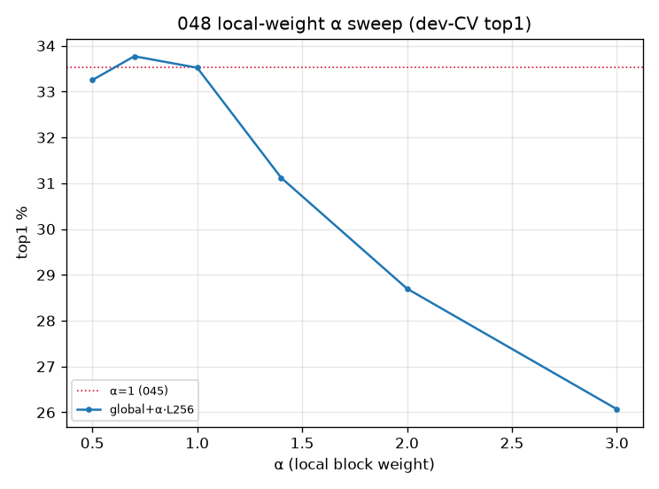
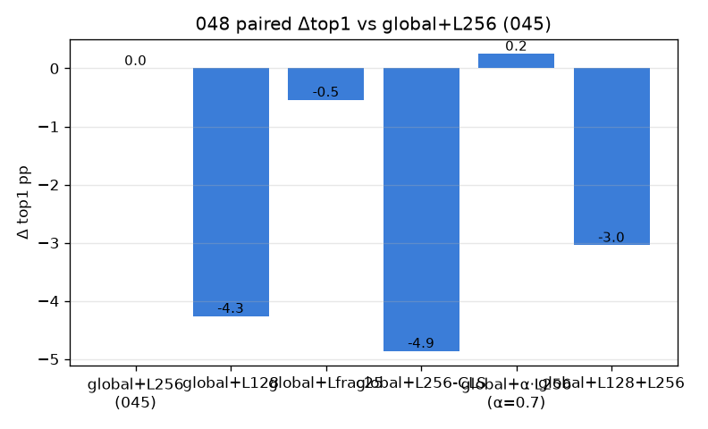

# 048 — M-rep0 정제: 단일 로컬 표현 개선 (해상도 레버 확장)

- 날짜: 2026-06-28 · 커밋 `main @ c5acd87` · `scripts/multiscale_refine.py`
- clean 502 (dev 1214/test 337 봉인), dev 10-seed CV 선택 + 봉인 test 1회 (§1.7).
- 045 교훈: 스케일 쌓으면 희석(L256+L512<L256) → 단일 로컬을 더 잘. baseline = global+L256 (045).

## 결과 (paired Δ vs global+L256)
| variant | dev-CV top1 | top5 | Δ vs L256 | wins |
|---|---|---|---|---|
| global+L256 (045) | 33.5±2.9 | 48.9 | +0.0 | 0/10 |
| global+L128 | 29.3±2.4 | 45.9 | -4.26 | 0/10 |
| global+Lfrac25 | 33.0±3.1 | 49.4 | -0.54 | 3/10 |
| global+L256-CLS | 28.7±2.6 | 45.7 | -4.86 | 0/10 |
| global+α·L256 (α=0.7) | 33.8±2.8 | 48.8 | +0.25 | 6/10 |
| global+L128+L256 | 30.5±3.7 | 45.7 | -3.04 | 0/10 |

- α-sweep(local 가중): 0.5:33.3 0.7:33.8 1.0:33.5 1.4:31.1 2.0:28.7 3.0:26.1 → best α=0.7.
- **봉인 TEST: global 33.5 → +L256 36.1 → best(global+α·L256 (α=0.7)) 35.3** (CI 29.4–40.9).
- 판정: 🟡 **추가 가산 없음** — global+L256(045)가 이미 단일-로컬 최선. 해상도 레버는 045에서 포화. 다음은 학습형 표현(M-rep1) 또는 데이터.

## 핵심
- 더 타이트(L128)·fraction·CLS·α-가중 중 어느 것도 L256를 못 넘음.
- 해상도 레버 상태: 045에서 포화 — 단일 고해상 로컬이 천장. 다음 축은 학습형 표현/데이터.
