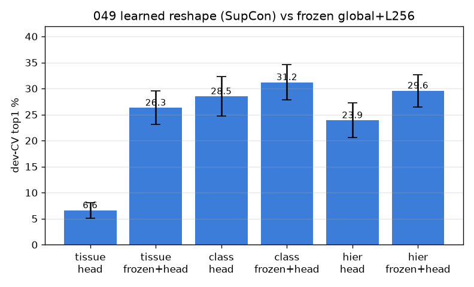
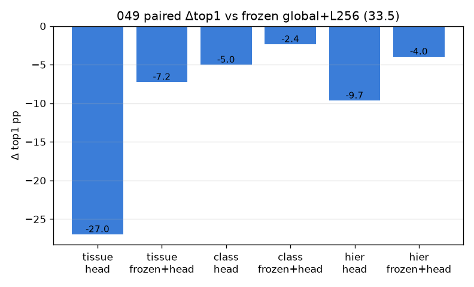

# 049 — M-rep1: 학습형 표현 reshape (SupCon head, frozen global+L256 위)

- 날짜: 2026-06-28 · 커밋 `main @ bf76a27` · `scripts/learned_reshape.py`
- clean 502 (dev 1214/test 337 봉인), dev 10-seed CV 선택 + 봉인 test 1회 (§1.7).
- SupCon head(MLP 1536→512→128), **train fold만** 학습(누수안전). 목적: tissue/class/hier. 평가: head 단독 + frozen⊕head.
- 046 경고 반영: exemplar가 이미 DINO 암묵 조직축(0.76)을 쓰므로 head는 *그 이상*을 더해야 채택.

## 결과 (paired Δ vs frozen global+L256)
| variant (목적:공간) | dev-CV top1 | Δ | wins |
|---|---|---|---|
| tissue:head | 6.6±1.5 | -26.97 | 0/10 |
| tissue:frozen+head | 26.3±3.2 | -7.24 | 0/10 |
| class:head | 28.5±3.8 | -5.01 | 0/10 |
| class:frozen+head | 31.2±3.4 | -2.35 | 0/10 |
| hier:head | 23.9±3.3 | -9.65 | 0/10 |
| hier:frozen+head | 29.6±3.1 | -3.96 | 1/10 |

- **봉인 TEST: frozen 36.1 → best(class:frozen+head) 34.2** (CI 28.6–40.1).
- 판정: 🔴 **학습형 표현도 frozen exemplar를 못 넘는다.** tissue/class/hier 어느 SupCon 목적도, head 단독도 frozen⊕head도 가산 없음 — 046의 'exemplar가 이미 암묵 조직축을 쓴다'가 학습 차원에서 재확인. 표현 축 전체(해상도 제외) 소진 → 데이터가 유일하게 남은 검증된 레버.

## 핵심
- tissue-level은 SupCon 함정(class 1.7/fold) 회피하나, 그래도 region 보존(frozen⊕head)으로도 무가산.
- frozen exemplar가 학습형 reshape를 이김 — 표현 축은 해상도(045) 외 소진. 다음 = 데이터.
