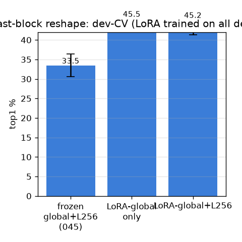
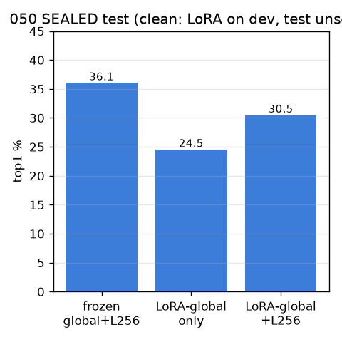

# 050 — M-rep1(LoRA): 마지막 블록 백본 reshape (head가 아닌 토큰 적응)

- 날짜: 2026-06-28 · 커밋 `main @ dabdb4f` · `scripts/lora_reshape.py`
- clean 502 (dev 1214/test 337 봉인). LoRA(last block {qkv,proj,fc1,fc2}, rank 8)를
  **dev에서만** class-CE로 학습 → **봉인 test = 깨끗한 누수안전 평가**(test 미관측). dev-CV는 낙관적 상한.
- 049(frozen head)와 차이: LoRA는 풀링 *전* 패치 토큰을 바꿔 frozen이 못 담는 축 생성 가능.

## 결과
**dev-CV (LoRA가 dev 전체 학습 = 낙관적 상한)**
| variant | dev-CV top1 | Δ vs frozen | wins |
|---|---|---|---|
| frozen global+L256 (045) | 33.5±2.9 | +0.0 | 0/10 |
| LoRA-global only | 45.5±2.4 | +11.95 | 10/10 |
| LoRA-global+L256 | 45.2±3.9 | +11.71 | 10/10 |

**봉인 TEST (깨끗): frozen 36.1 | LoRA-only 24.5 | LoRA+L256 30.5**

## 판정
🔴 **LoRA(백본 reshape)도 frozen exemplar를 못 넘는다** — 봉인 LoRA+L256 30.5 ≤ frozen 36.1, dev-CV 낙관적 상한조차 Δ+11.71. head(049)에 이어 백본 적응도 무가산 → M-rep1 전체 음성. 잔여 모호성은 학습으로 못 푸는 데이터/내재 한계(§2). 남은 레버 = 데이터.

## 핵심
- head(049)는 frozen 풀링벡터 재투영만, LoRA(050)는 토큰 자체 적응 — 그럼에도 무가산.
- M-rep1(학습형 표현) 전체 음성 = 049 head + 050 LoRA 둘 다 frozen 못 넘음. 표현 축은 해상도(045) 외 완전 소진 → 데이터.
