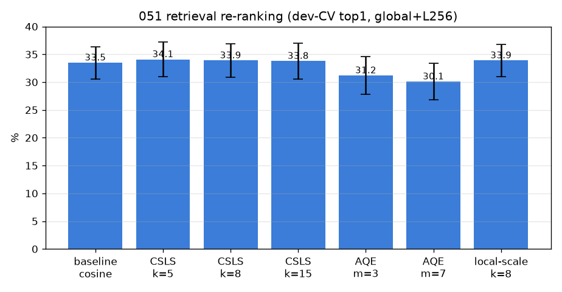
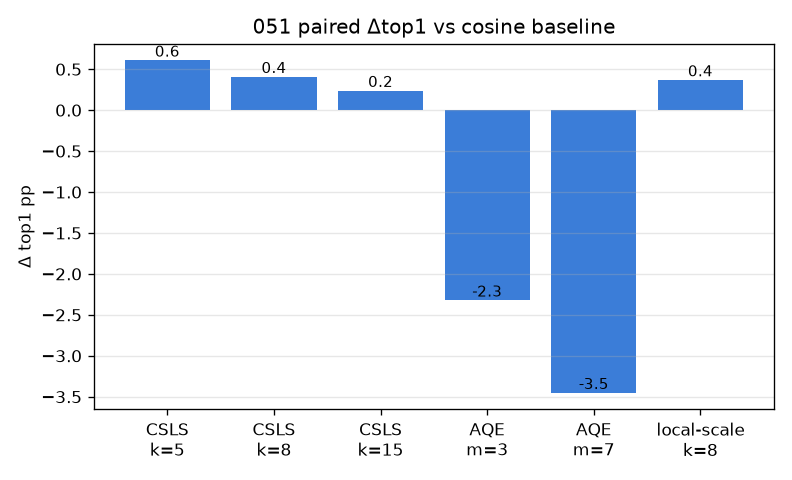

# 051 — 검색 재순위화 (CSLS·AQE·local-scaling, 학습-free)

- 날짜: 2026-06-28 · 커밋 `main @ 805c768` · `scripts/rerank_retrieval.py`
- clean 502 (dev 1214/test 337 봉인), global+L256, dev 10-seed CV paired. 봉인 test는 채택분만.
- 동기: re-ID 문헌의 학습-free 부스터로 exemplar 1-NN의 hubness(CSLS)·비대칭(AQE)·국소밀도(local-scaling) 교정.

## 결과 (paired Δ vs cosine)
| 방법 | dev-CV top1 | Δ | wins |
|---|---|---|---|
| baseline cosine | 33.5±2.9 | +0.0 | 0/10 |
| CSLS k=5 | 34.1±3.1 | +0.61 | 7/10 |
| CSLS k=8 | 33.9±3.0 | +0.41 | 6/10 |
| CSLS k=15 | 33.8±3.2 | +0.24 | 5/10 |
| AQE m=3 | 31.2±3.4 | -2.32 | 0/10 |
| AQE m=7 | 30.1±3.3 | -3.45 | 0/10 |
| local-scale k=8 | 33.9±2.9 | +0.37 | 6/10 |

## 판정
🟢 **CSLS k=5** 가 cosine을 이김 (dev Δ+0.61, 7/10) | SEALED: base 36.1 → CSLS k=5 38.3 → 채택.
