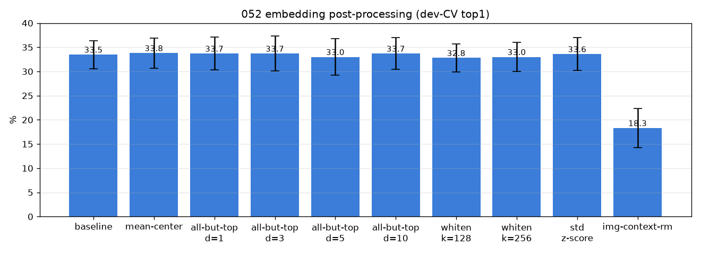
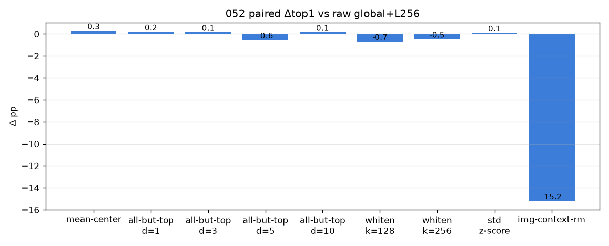

# 052 — 임베딩 후처리 (all-but-the-top·whitening·표준화·이미지맥락제거)

- 날짜: 2026-06-28 · 커밋 `main @ 73971f9` · `scripts/embed_postproc.py`
- clean 502 (dev 1214/test 337 봉인), global+L256, 변환은 갤러리(train fold)에서만 fit. dev 10-seed paired.
- 동기(042): DINO 공간은 부위 분산이 지배 → 그 상위 주성분을 제거/균등화하면 미세정체성이 드러날까.

## 결과 (paired Δ vs raw cosine)
| 변환 | dev-CV top1 | Δ | wins |
|---|---|---|---|
| baseline | 33.5±2.9 | +0.0 | 0/10 |
| mean-center | 33.8±3.1 | +0.29 | 3/10 |
| all-but-top d=1 | 33.7±3.4 | +0.19 | 5/10 |
| all-but-top d=3 | 33.7±3.6 | +0.15 | 5/10 |
| all-but-top d=5 | 33.0±3.8 | -0.57 | 4/10 |
| all-but-top d=10 | 33.7±3.3 | +0.15 | 4/10 |
| whiten k=128 | 32.8±2.9 | -0.7 | 3/10 |
| whiten k=256 | 33.0±3.0 | -0.5 | 4/10 |
| std z-score | 33.6±3.4 | +0.09 | 4/10 |
| img-context-rm | 18.3±4.0 | -15.23 | 0/10 |

## 판정
🔴 **후처리 무효** — all-but-top/whiten/std/img-context 어느 것도 raw cosine을 못 넘음 (best mean-center Δ+0.29). 부위지배 분산을 선형 제거해도 미세정체성이 안 살아남 = 부위/정체성이 같은 부분공간에 얽혀 선형분리 불가.
