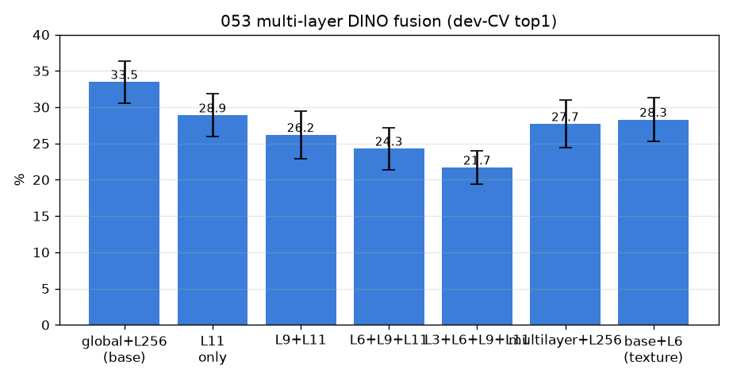
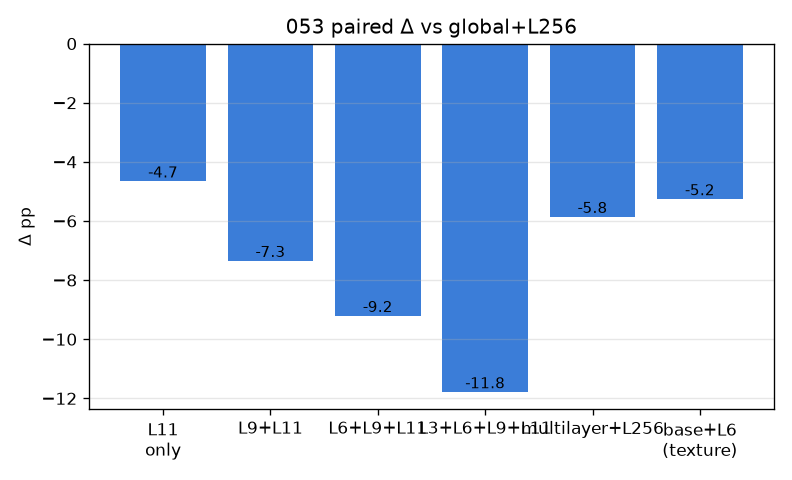

# 053 — 멀티레이어 DINO 융합 (블록 3/6/9/11을 q에서 풀링·concat)

- 날짜: 2026-06-28 · 커밋 `main @ 2dc368f` · `scripts/multilayer_fusion.py`
- clean 502 (dev 1214/test 337 봉인), dev 10-seed paired. baseline = global+L256.
- 동기: 얕은/중간 블록 = 미세 텍스처(혈관벽·결), 마지막 = 의미(부위). 여러 층 결합이 미세단서 보강?

## 결과 (paired Δ vs global+L256)
| 변형 | dev-CV top1 | Δ | wins |
|---|---|---|---|
| global+L256 (base) | 33.5±2.9 | +0.0 | 0/10 |
| L11 only | 28.9±3.0 | -4.65 | 0/10 |
| L9+L11 | 26.2±3.3 | -7.34 | 0/10 |
| L6+L9+L11 | 24.3±2.9 | -9.2 | 0/10 |
| L3+L6+L9+L11 | 21.7±2.3 | -11.78 | 0/10 |
| multilayer+L256 | 27.7±3.3 | -5.85 | 0/10 |
| base+L6 (texture) | 28.3±3.0 | -5.25 | 0/10 |

## 판정
🔴 **멀티레이어 무효** — 얕은/중간 블록을 더해도 global+L256 못 넘음 (best L11 only Δ-4.65). 마지막층이 이미 q에서 필요한 정보를 담고 있고, 얕은층 텍스처는 부위내 정체성에 신호 안 됨.
