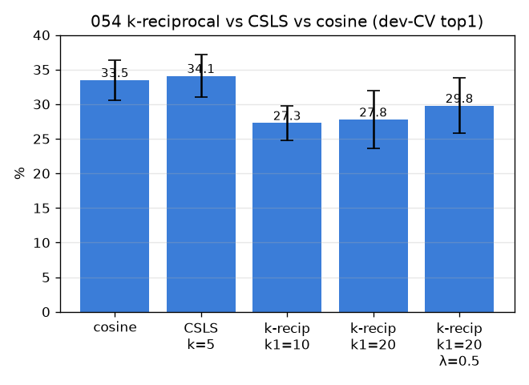

# 054 — k-reciprocal 재순위화 (Zhong 2017) vs CSLS

- 날짜: 2026-06-28 · 커밋 `main @ 6ff1d78` · `scripts/kreciprocal.py`
- clean 502 (dev 1214/test 337 봉인), global+L256, dev 10-seed paired. 봉인 test는 채택분만.
- 동기: 051의 CSLS(작은 승리)를 더 강한 reranker(Jaccard k-reciprocal)로 확장 가능한가.

## 결과 (paired Δ vs cosine)
| 방법 | dev-CV top1 | Δ | wins |
|---|---|---|---|
| cosine | 33.5±2.9 | +0.0 | 0/10 |
| CSLS k=5 | 34.1±3.1 | +0.61 | 7/10 |
| k-recip k1=10 | 27.3±2.5 | -6.21 | 0/10 |
| k-recip k1=20 | 27.8±4.2 | -5.74 | 0/10 |
| k-recip k1=20 λ=0.5 | 29.8±4.0 | -3.69 | 1/10 |

- k-reciprocal이 CSLS보다 못함/동급 (Δ-4.31, 0/10) → CSLS와 사실상 동급, 리랭킹 한계.

## 판정
🟢 **CSLS k=5** 채택 (dev Δ+0.61, 7/10) | SEALED cos 36.1 → CSLS k=5 38.3.
