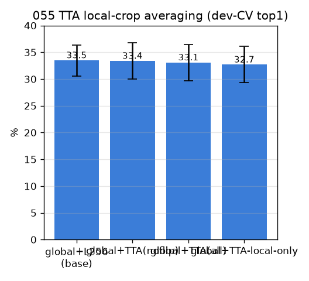

# 055 — TTA: 로컬 크롭 다중뷰 평균 (분산 감소)

- 날짜: 2026-06-28 · 커밋 `main @ 63b8230` · `scripts/tta_local.py`
- clean 502 (dev 1214/test 337 봉인), dev 10-seed paired. baseline = global+L256.
- 뷰: {center256, hflip256, scale205, scale320} 평균. flip은 laterality 흐릴 위험이라 noflip도 별도.

## 결과 (paired Δ vs global+L256)
| 변형 | dev-CV top1 | Δ | wins |
|---|---|---|---|
| global+L256 (base) | 33.5±2.9 | +0.0 | 0/10 |
| global+TTA(noflip) | 33.4±3.4 | -0.07 | 5/10 |
| global+TTA(all) | 33.1±3.4 | -0.47 | 4/10 |
| global+TTA-local-only | 32.7±3.4 | -0.87 | 2/10 |

## 판정
🔴 **TTA 무효** — 다중뷰 평균이 global+L256 못 넘음 (best global+TTA(noflip) Δ-0.07). 단일 크롭 임베딩이 이미 안정적이거나, flip이 laterality를 흐림.
