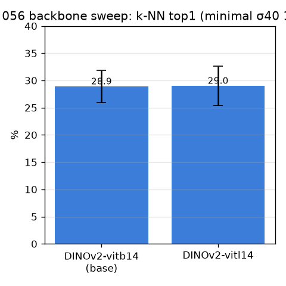
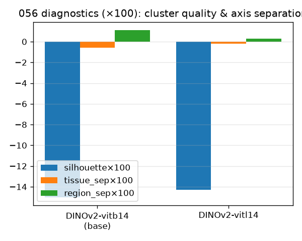

# 056 — M-bb0: 백본 sweep (최소 세팅, 학습 0)

- 날짜: 2026-06-28 · 커밋 `main @ 79ce1ff` · `scripts/backbone_sweep.py`
- clean 502 (dev 1214/test 337 봉인), 최소 세팅(σ40 GaussianPool + exemplar 1-NN, L256/CSLS 없음), 10-seed.
- 주지표 = k-NN top1(우리 readout 그 자체). 진단 = silhouette/hubness/tissue·region centroid sep.
- ⚠️ **DINOv3 (핵심 후보)는 HF gated=manual → 라이선스 수락 대기** (facebook/dinov3-vitb16/vitl16). 수락 후 BACKBONES에 추가하면 한 줄.

## 결과 (paired Δ vs DINOv2-vitb14)
| 백본 | k-NN top1 | Δ | wins | silhouette | hubness | tissue_sep | region_sep |
|---|---|---|---|---|---|---|---|
| DINOv2-vitb14 (base) | 28.9±3.0 | +0.0 | 0/10 | -0.15 | 0.696 | -0.006 | 0.011 |
| DINOv2-vitl14 | 29.0±3.6 | +0.09 | 4/10 | -0.143 | 0.84 | -0.002 | 0.003 |

## 판정
🟡 best DINOv2-vitl14 게이트 미달 (Δ+0.09). DINOv2 세대내 크기로는 부족(019 재확인) — **진짜 검증은 DINOv3** (gated, 라이선스 수락 대기).

## 핵심
- 019(세대내 크기, +1.1)를 clean 502 + 메트릭 풀세트로 재검증. 세대내 크기가 작은 이득.
- **진짜 프론티어 = 세대 교체(DINOv3)** — gated라 막힘. 라이선스 수락이 다음 차단해제.
