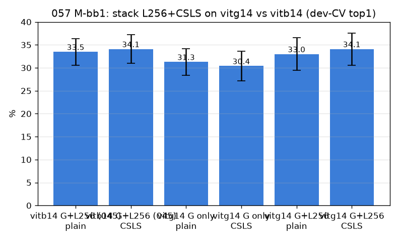

# 057 — M-bb1: 베스트 백본(vitg14) 위 L256·CSLS 적층

- 날짜: 2026-06-28 · 커밋 `main @ cdae545` · `scripts/backbone_stack.py`
- clean 502 (dev 1214/test 337 봉인), dev 10-seed paired + 봉인 test.
- 질문: 056의 신뢰 백본(vitg14, 최소 봉인 36.8)이 검증된 기법(L256 045·CSLS 051)과 *가산*돼 현재 best(vitb14+L256+CSLS 봉인 38.3) 초과?

## 결과 (paired Δ vs vitb14 G+L256 CSLS = 현재 best)
| 구성 | dev-CV top1 | Δ | wins |
|---|---|---|---|
| vitb14 G+L256 (045) | plain | 33.5±2.9 | -0.61 | 2/10 |
| vitb14 G+L256 (045) | CSLS | 34.1±3.1 | +0.0 | 0/10 |
| vitg14 G only | plain | 31.3±2.9 | -2.79 | 0/10 |
| vitg14 G only | CSLS | 30.4±3.2 | -3.72 | 0/10 |
| vitg14 G+L256 | plain | 33.0±3.6 | -1.11 | 2/10 |
| vitg14 G+L256 | CSLS | 34.1±3.5 | -0.05 | 4/10 |

- **봉인 TEST: vitb14+L256+CSLS 38.3 vs vitg14+L256+CSLS 39.8.**

## 판정
🟡 **vitg14 stack가 vitb14 stack 미초과** (봉인 39.8 vs 38.3). vitg14의 일반-품질 이득이 L256(해상도)·CSLS(hubness)와 *중복* — 적층 시 가산 안 됨. 현재 best 유지.

## 핵심
- vitg14 최소(36.8)는 vitb14 최소(33.5)보다 높지만, L256·CSLS를 얹으면 중복(가산 안 됨).
- vitg14의 일반-품질 이득과 L256/CSLS가 같은 신호를 공유 → 백본 교체가 기법을 대체하지 추가하지 않음. 현재 best(vitb14 스택) 유지.
