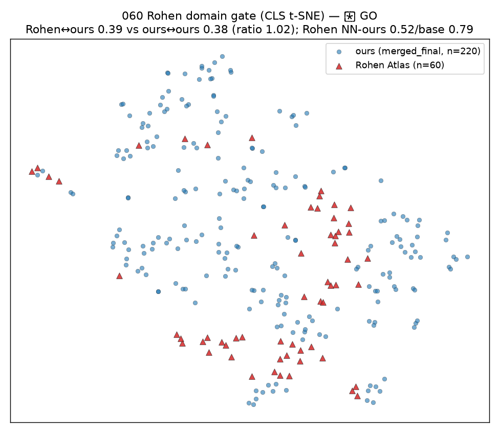
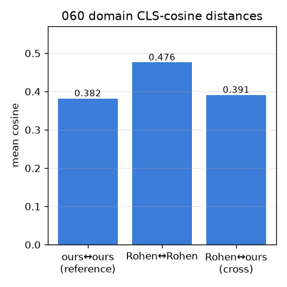

# 060 / M-rohen0 STEP 0 — Rohen Atlas 도메인 게이트 (학습 0, 추출 없이)

- 날짜: 2026-06-28 · 커밋 `main @ b588007` · `scripts/rohen_domain_probe.py`
- 질문: Rohen 카데바 사진이 우리 merged_final과 *임베딩 공간에서 가까운가* (gallery 추가가 작동할 도메인인가).
- 방법: Rohen 메인 사진 60장(섹션/MRI/일러스트 텍스트 제외) + 우리 220장, **둘 다 vitb14@518 CLS**(핀 무관 공정 비교).

## 거리 (CLS cosine)
| 쌍 | 평균 cos |
|---|---|
| ours↔ours (in-domain 기준) | 0.382 |
| Rohen↔Rohen | 0.476 |
| **Rohen↔ours (cross)** | **0.391** (ours 대비 비 1.02) |

- Rohen 20-NN 중 ours 비율 **0.52** (무작위 base rate 0.79); Rohen #1-NN이 ours인 비율 0.25.

## 판정 (사전등록 게이트)
🟢 **GO** — 🟢 도메인 일치 — Rohen↔ours 0.391 ≈ ours↔ours 0.382 (비 1.02), Rohen의 20-NN 중 ours 비율 0.52(base 0.79). STEP 1 추출 진행.

## 다음
- 🟢 STEP 1 추출 파일럿 (소규모 (I,q,y) → gallery 추가 → sealed Δtop1).
- ⚠️ 주의: Rohen은 raw(번호/선 포함), 우리는 cleaned — 미세 confound이나 도메인(전문촬영 vs 교육용)이 지배.
